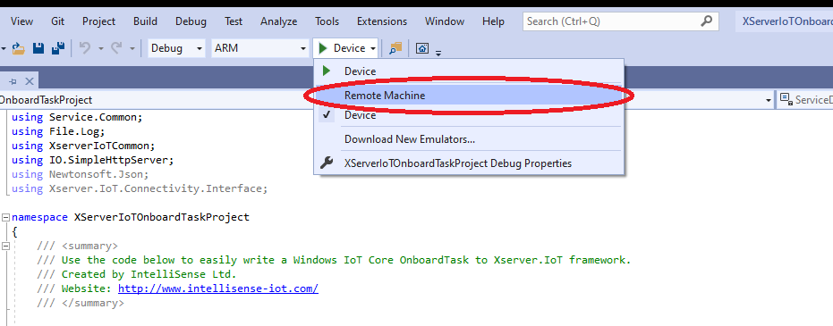
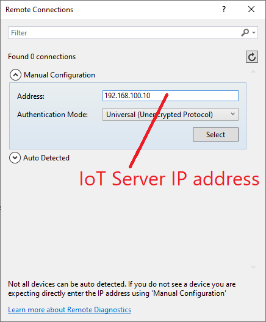
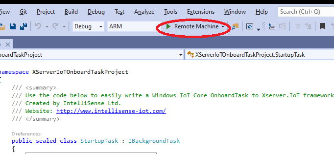
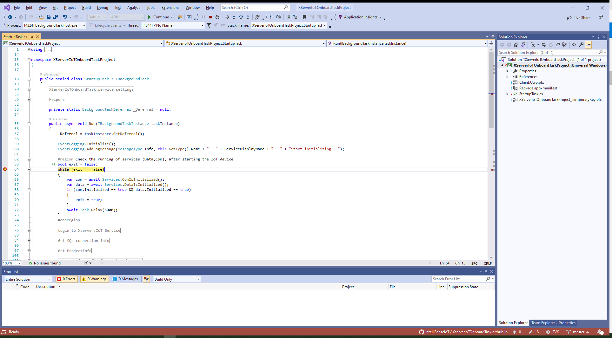

# Debug OnboardTask app on an IoT Server from Visual Studio

You can use Visual Studio to run, debug, profile, and test a OnboardTask app on IoT device.

[Microsoft Tutorial: Debug UWP apps on remote machines from Visual Studio](https://docs.microsoft.com/en-us/visualstudio/debugger/run-windows-store-apps-on-a-remote-machine?view=vs-2019)
