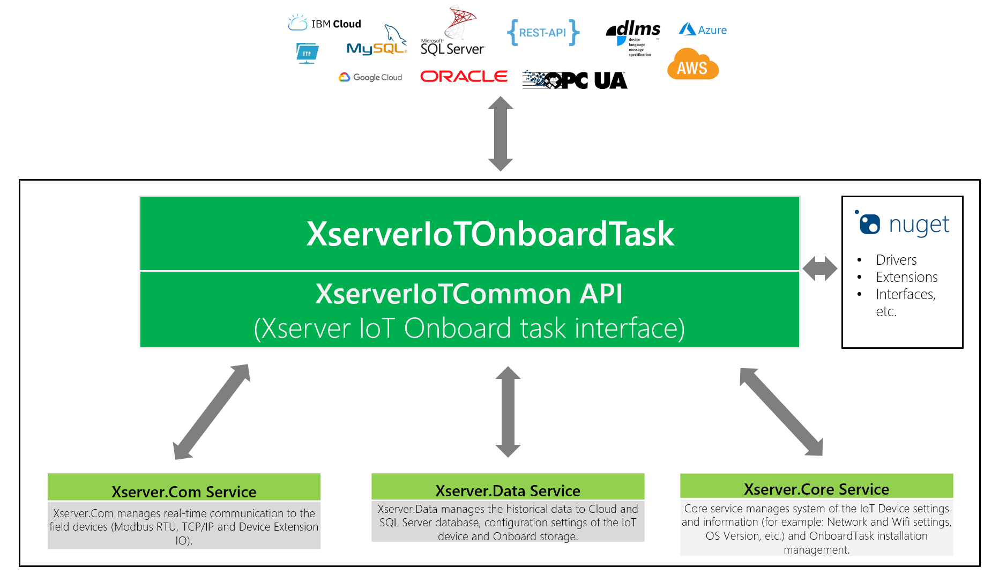
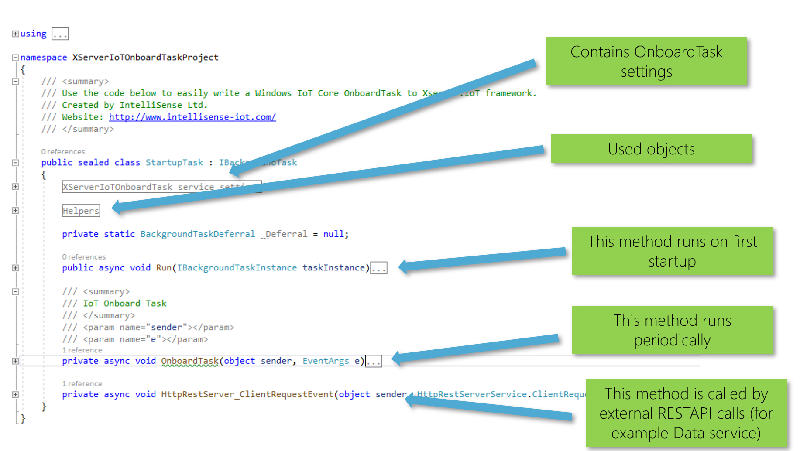

# OnboardTask Architecture Overview

## Interfaces:

## Code:

## More details:

### XServerIoTOnboardTask service settings
        
    //Service display name, the following name is used in the event log
    private const string ServiceDisplayName = "Xserver.OnboardTask";
    
    //Periodic run time of the onboardtask method (ms)
    private const int TaskHandlerPeriod = 1000;
 
### First Run
 
In the code below, the tasks required for the first run are performed.
    
    public async void Run(IBackgroundTaskInstance taskInstance)
    {
        _Deferral = taskInstance.GetDeferral();

        EventLogging.Initialize();
        EventLogging.AddLogMessage(MessageType.Info, this.GetType().Name + " - " + ServiceDisplayName + " - " + "Start initializing...");

        //Todo: Write your initial code here

        //Initialize Http REST server
        await RestServer.HttpRESTServerStart();
        RestServer.ClientEvent += HttpRestServer_ClientRequestEvent;

        //Initialize and Start IoT OnboardTask
        OnboardTaskHandler.WaitingTime = TaskHandlerPeriod;
        OnboardTaskHandler.ThresholdReached += OnboardTask;
        OnboardTaskHandler.Run();

        EventLogging.AddLogMessage(MessageType.Info, this.GetType().Name + " - " + ServiceDisplayName + " - " + "Finished initialization.");
    }

### RESTAPI Calls

We can make our own RESTAPI interface that external applications can call. GET and POST calls are supported.
This RESTAPI interface is used by the DATA service also, which invokes certain events ([for example: Desired properties change callback](https://github.com/IntelliSenseIoT/XserverIoTOnboardTask.github.io/blob/master/examples/6_Device_Twin_Desired_Change_Callback.md)). 
    
    private async void HttpRestServer_ClientRequestEvent(object sender, HttpRestServerService.ClientRequestEventArgs e)
    {
        IO.SimpleHttpServer.Result res = new IO.SimpleHttpServer.Result();

        try
        {
            if (e.RequestMethod == RequestMethodType.GET)
            {
                //Todo: Type your code here
                // Example:
                //if (e.uriString.ToLower() == "/onboardtask/examplegeturi")
                //{
                //    string content = JsonConvert.SerializeObject(YourObject);
                //    res = await RestServer.ServerResponse(HTTPStatusCodes.OK, e.OStream, content);
                //}
            }
            else if (e.RequestMethod == RequestMethodType.POST)
            {
                //Todo: Type your code here
                // Example:
                //if (e.uriString.ToLower() == "/onboardtask/exampleposturi")
                //{  
                //    YourObject MyObj = JsonConvert.DeserializeObject<YourObject>(e.HttpContent);
                //    ....
                //    string content = JsonConvert.SerializeObject(answer);
                //    res = await RestServer.ServerResponse(HTTPStatusCodes.OK, e.OStream, content);
                //}
            }
            else
            {
                res = await RestServer.ServerResponse(HTTPStatusCodes.Not_Found, e.OStream, null);
            }
        }
        catch (Exception ex)
        {
            EventLogging.AddLogMessage(MessageType.ExceptionError, this.GetType().Name + " - " + ServiceDisplayName + " - " + "Http REST server exception error! Error: " + ex.Message);
        }
    }
