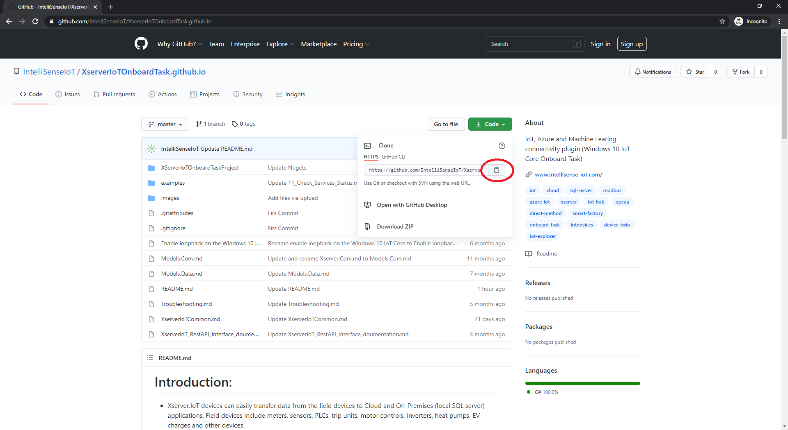
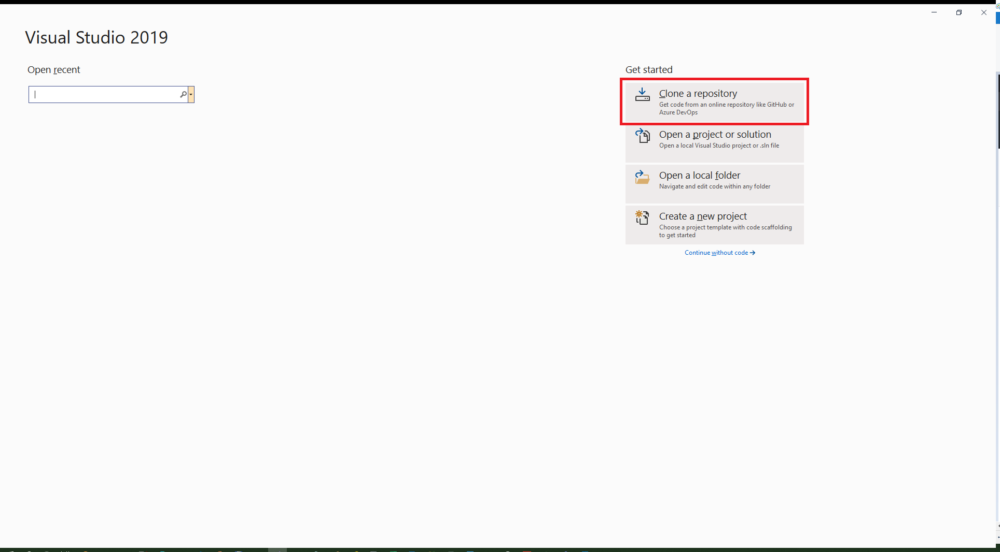
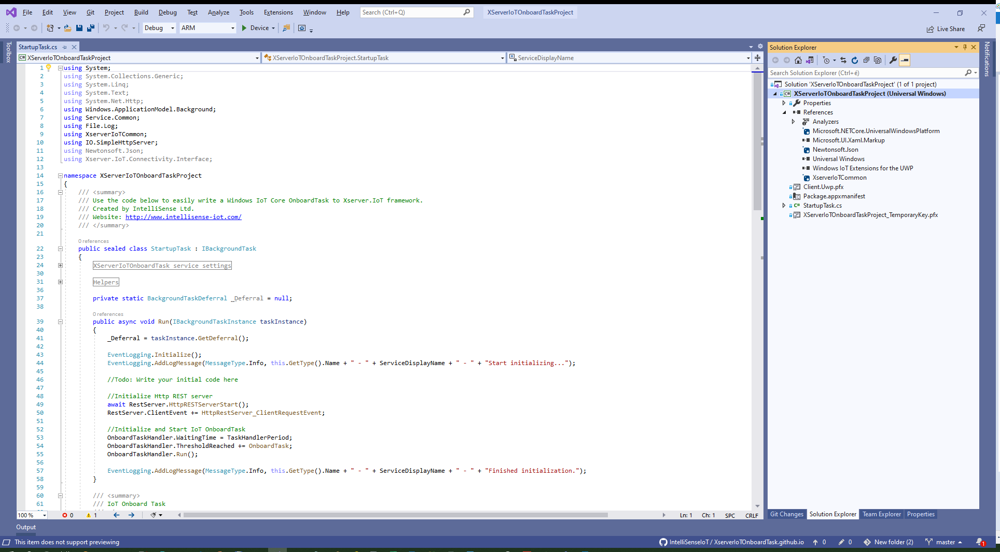

## Open an OnboardTask project from GitHub repo

1) Open IoT Server OnboardTask project on Github website [Click here](https://github.com/IntelliSenseIoT/XserverIoTOnboardTask.github.io)
2) Copy the repository location

3) Open Visual Studio 2019

4) Paste the repository location and then select Clone.

[Microsoft Tutorial: Open a project from a repo](https://docs.microsoft.com/en-us/visualstudio/get-started/tutorial-open-project-from-repo-visual-studio-2019?view=vs-2019&tabs=vs168later)
