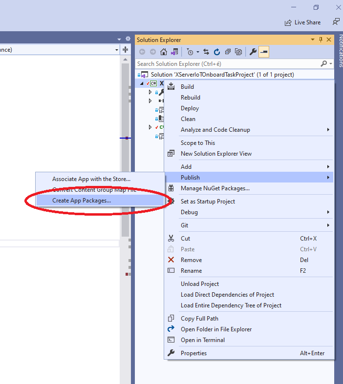
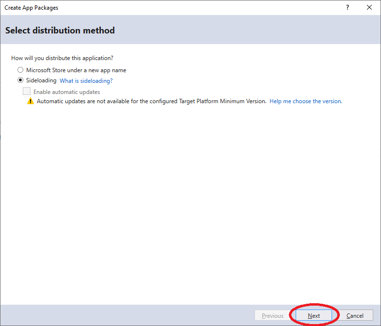
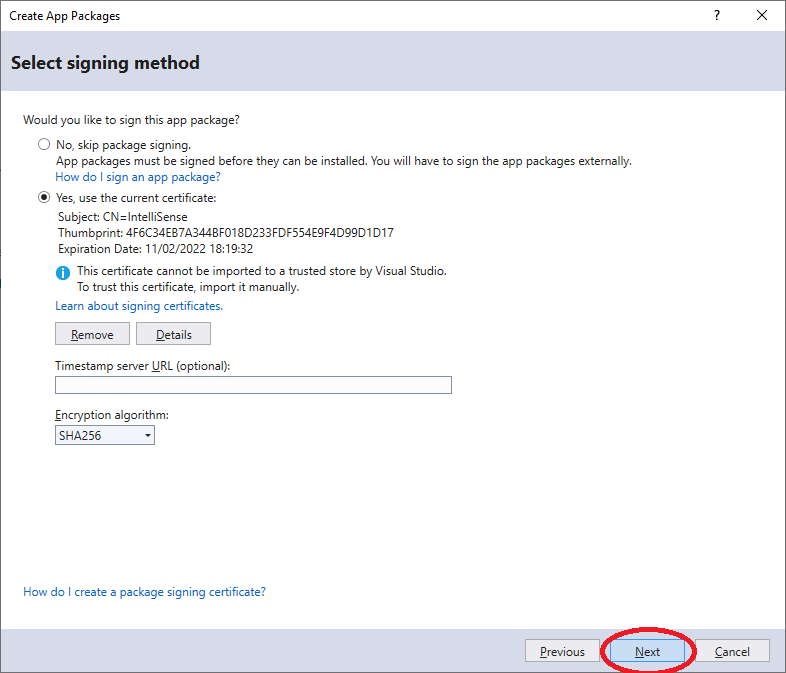
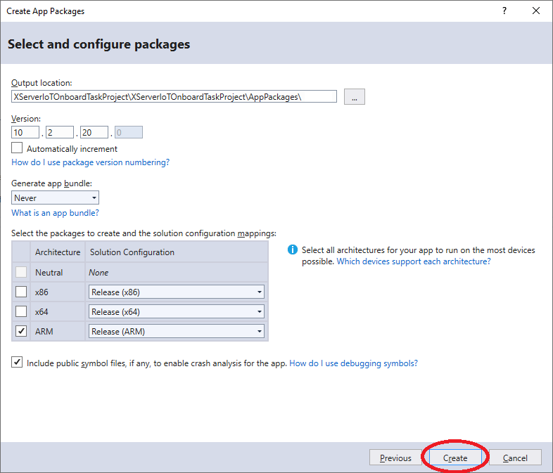
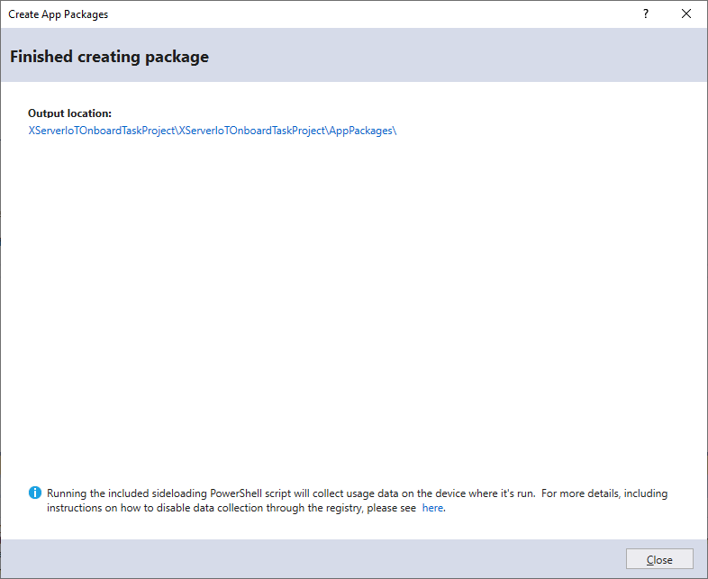
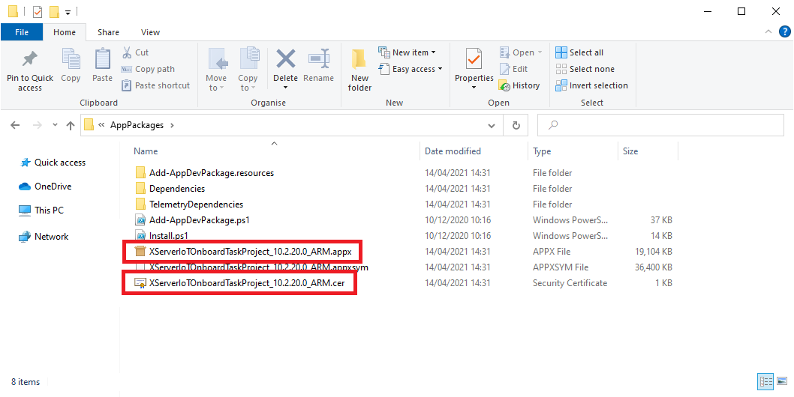

# Publish your OnboardTask project (create appx package)

[Microsoft Tutorial: Package a desktop or UWP app in Visual Studio](ttps://docs.microsoft.com/en-us/windows/msix/package/packaging-uwp-apps)
