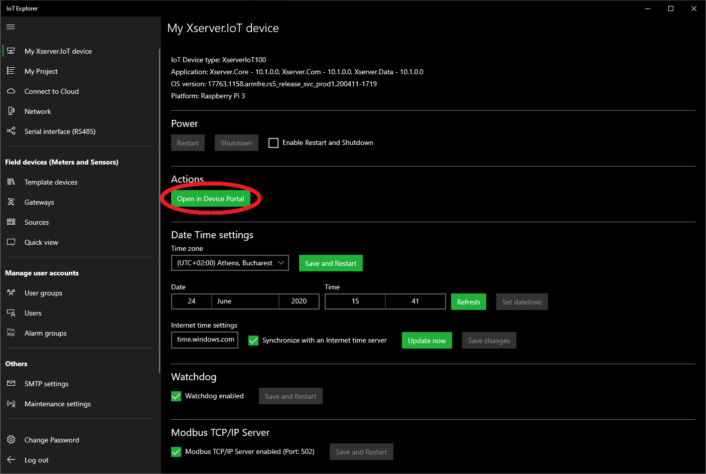
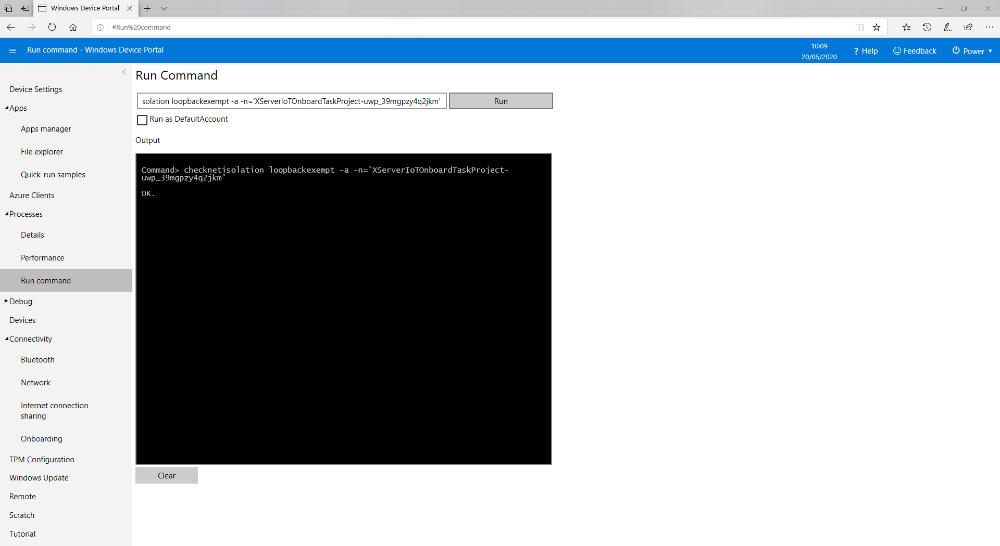

# Introduction:

Xserver.IoT.Framework can easily manage data from field devices to Cloud and SQL server applications. Field devices include meters, sensors, PLCs, trip units, motor controls, and other devices.
This capability allows the use of reporting, analysis and AI software (Machine Learning, Power BI, SAP, Energy Management, Smart City software, etc.) to access information from devices for data collection, trending, alarm/event management, analysis, and other functions.

More details: https://www.intellisense-iot.com/
Technical overview: https://www.youtube.com/watch?v=_fmbNuYwyqE&list=UUcLou6GZjtQRWgN1ukcglpg&index=14        
Nugets: https://www.nuget.org/packages/XserverIoTCommon/

# XserverIoTOnboardTask:

## Required UWP Target settings:

    Min version: Windows 10 Fall Creators Update (10.0; Build 16299) 

## Required UWP Capabilities:

    <Capability Name="internetClient" />
    <Capability Name="internetClientServer"/>
    <Capability Name="privateNetworkClientServer"/>

## Before use app, enable loopback on the Windows 10 IoT Core::

    checknetisolation loopbackexempt -a -n='XServerIoTOnboardTaskProject-uwp_39mgpzy4q2jkm'

### 1) Open in Device Portal (In IoT Explorer - https://www.intellisense-iot.com/downloads)

### 2) Run command (checknetisolation loopbackexempt -a -n='XServerIoTOnboardTaskProject-uwp_39mgpzy4q2jkm')

## Example 1 (Real-time):

        #region Helpers
        //.....
        Realtime RObj = new Realtime();
        #endregion

        private static BackgroundTaskDeferral _Deferral = null;
        public void Run(IBackgroundTaskInstance taskInstance)
        {
            _Deferral = taskInstance.GetDeferral();

            ServiceLogging.AddLogMessage(MessageType.Info, this.GetType().Name + " - " + ServiceDisplayName + " - " + "Start initializing...");

            //Todo: Before use this code, enable loopback in Windows 10 IoT Core: checknetisolation loopbackexempt -a -n='XServerIoTOnboardTaskProject-uwp_39mgpzy4q2jkm'
          
            Init();
        }
        private async void Init()      //Initialize service
        {
            bool error = false;

            #region Login to Xserver.IoT Service
            var res = await Authentication.Login("operator", "operator");
            if (res.Success == false)
            {
                ServiceLogging.AddLogMessage(MessageType.Error, this.GetType().Name + " - " + ServiceDisplayName + " - " + res.ErrorMessage);
                error = true;
            }
            #endregion

            #region Gets List of Sources and Quantities
            var result = await RObj.GetSourcesQuantities();
            if (result.Success == false)
            {
                ServiceLogging.AddLogMessage(MessageType.Error, this.GetType().Name + " - " + ServiceDisplayName + " - " + result.ErrorMessage);
                error = true;
            }
            #endregion

            #region Initialize and Start IoT OnboardTask
            OnboardTaskHandler.WaitingTime = TaskHandlerPeriod;
            OnboardTaskHandler.ThresholdReached += OnboardTask;
            OnboardTaskHandler.Run();
            #endregion

            ServiceLogging.AddLogMessage(MessageType.Info, this.GetType().Name + " - " + ServiceDisplayName + " - " + "Finished initialization.");
        }
       
        /// IoT Onboard Task
        private async void OnboardTask(object sender, EventArgs e)
        {
            try
            {
                //Todo: Type your onboard task code here

                var Light = await RObj.GetValue("Compressor", "Run");

                var Status =await  RObj.GetValue("Compressor", "Valve - Status");

                if (Light.Value >0 && Status.Value !=1)
                {
                    var writeresult = await RObj.WriteValue("Compressor", "Valve - Status", 1);
                }
            }
            catch (Exception ex)
            {
                ServiceLogging.AddLogMessage(MessageType.ExceptionError, this.GetType().Name + " - " + ServiceDisplayName + " - " + "OnboardTask exception error! Error: " + ex.Message);
            }
            OnboardTaskHandler.Run();  //Task continues to run
        }

