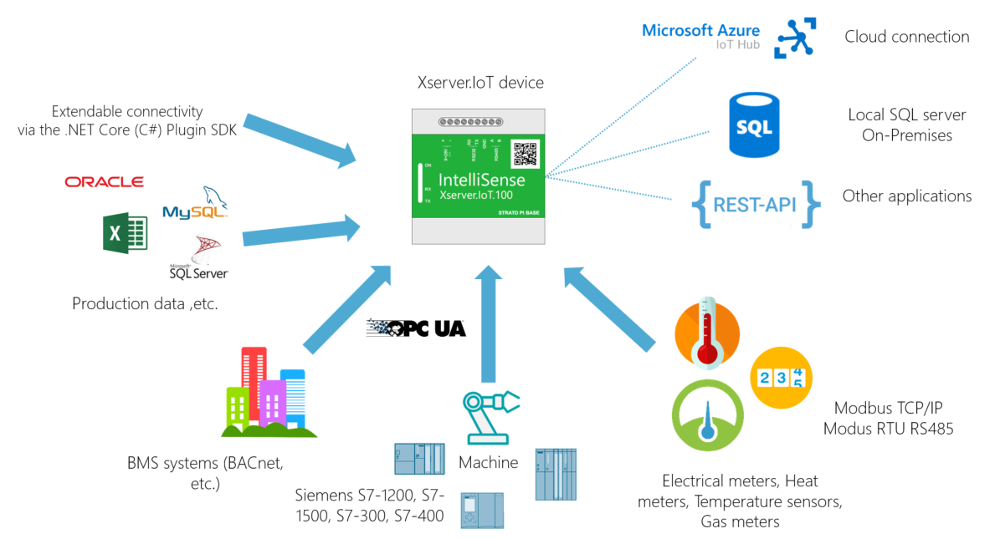
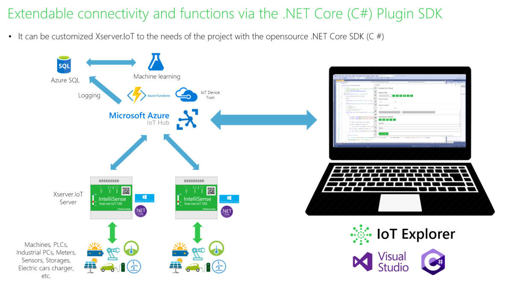

# Introduction:

- Xserver.IoT devices can easily transfer data from the field devices to Cloud and On-Premises (local SQL server) applications. Field devices include meters, sensors, PLCs, trip units, motor controls, inverters, heat pumps, EV charges and other devices.

- Easy to integrate into your corporate system (SAP, Energy Management Software, Manufacturing Execution Systems, Building Management Software, Smart City software, Power BI, etc.) with flexible connectivity (REST API, Azure IoT HUB, Google Cloud, AWS, IBM Cloud, MS SQL Server, My SQL, Oracle, Extendable connectivity via .NET Core SDK)

- This capabilities allow the use of reporting, analysis, and AI software to access information from devices for data collection, trending, alarm/event management, analysis, remote control, and other functions.

# Xserver.IoT OnboardTask Overview:

With the Onboard Task project can be implemented customized tasks (Industrial PC communication, Custom protocol matching, Control tasks, Remote parameter setting from cloud, Control with Artificial Intelligence, etc.).

- More details: https://www.intellisense-iot.com/
- [Technical overview about IoT Server](https://www.intellisense-iot.com/xserver-iot-product) 
- [Open an OnboardTask project from GitHub repo in Visual Studio](https://github.com/IntelliSenseIoT/XserverIoTOnboardTask.github.io/blob/master/Open%20an%20OnboardTask%20project%20from%20GitHub%20repo.md)
- [OnboardTask Architecture Overview](https://github.com/IntelliSenseIoT/XserverIoTOnboardTask.github.io/blob/master/OnboardTask%20Architecture%20Overview.md)
- [Debug OnboardTask app on an IoT Server from Visual Studio](https://github.com/IntelliSenseIoT/XserverIoTOnboardTask.github.io/blob/master/Debug%20OnboardTask%20apps%20on%20IoT%20Server%20from%20Visual%20Studio.md)
- [Publish your OnboardTask project (create appx package)](https://github.com/IntelliSenseIoT/XserverIoTOnboardTask.github.io/blob/master/Publish%20your%20OnboardTask%20project%20(create%20appx%20package).md)
- [Upload your OnboardTask app to IoT Server on the IoT Server Device Portal](https://github.com/IntelliSenseIoT/XserverIoTOnboardTask.github.io/blob/master/Upload%20your%20OnboardTask%20app%20on%20IoT%20Server%20Device%20Portal.md)
- [Upload your OnboardTask app to IoT Server via Azure](https://www.youtube.com/watch?v=odZtoA1Ns0Q&t=5s)
- [XserverIoTCommon API description](https://github.com/IntelliSenseIoT/XserverIoTOnboardTask.github.io/blob/master/XserverIoTCommon.md)
- [Xserver.IoT REST API interface documentation](https://github.com/IntelliSenseIoT/XserverIoTOnboardTask.github.io/blob/master/XserverIoT_RestAPI_Interface_doumentation.md)
- [IoTServerInsertionAPI description](https://github.com/IntelliSenseIoT/XserverIoTOnboardTask.github.io/blob/master/IoTServerInsertionAPI.md)
- [Nugets](https://www.nuget.org/packages/XserverIoTCommon/)
- [Troubleshootings](https://github.com/IntelliSenseIoT/XserverIoTOnboardTask.github.io/blob/master/Troubleshooting.md)

# XserverIoTOnboardTask:

## Required UWP Target settings

    Min version: Windows 10 Fall Creators Update (10.0; Build 16299) 

## Required Xserver.IoT firmware

    Required Xservet.IoT.100 device
    Min version: 10.3.x

## Required UWP Capabilities

    <Capability Name="internetClient" />
    <Capability Name="internetClientServer"/>
    <Capability Name="privateNetworkClientServer"/>

# Examples:

[Example 1 - Real-time values (Access Sources and Quantites)](https://github.com/IntelliSenseIoT/XserverIoTOnboardTask.github.io/blob/master/examples/1_Real-time%20values.md)

[Example 2 - IoT Server and OPCUA Server communication](https://github.com/IntelliSenseIoT/XserverIoTOnboardTask.github.io/blob/master/examples/2_IoT%20Server%20and%20OPCUA%20Server%20communication.md)

[Example 3 - OPC UA Real-time value(s) logging with Template device usage](https://github.com/IntelliSenseIoT/XserverIoTOnboardTask.github.io/blob/master/examples/3_OPC%20UA%20Real-time%20value(s)%20logging.md)

[Example 4 - Onboard Task and Azure Direct Method](https://github.com/IntelliSenseIoT/XserverIoTOnboardTask.github.io/blob/master/examples/4_OnboardTask%20and%20Azure%20Direct%20Method.md)

[Example 5 - MES & Siemens S7 PLC OPC UA connection](https://github.com/IntelliSenseIoT/XserverIoTOnboardTask.github.io/blob/master/examples/5_MES_Siemens_OPCUA_connection.md)

[Example 6 - Device twin Desired properties change callback](https://github.com/IntelliSenseIoT/XserverIoTOnboardTask.github.io/blob/master/examples/6_Device_Twin_Desired_Change_Callback.md)

[Example 7 - Device twin management with IoT server](https://github.com/IntelliSenseIoT/XserverIoTOnboardTask.github.io/blob/master/examples/7_Device_twin_management_with_IoT_server.md)

[Example 8 - Read and Save config and properties to Onboard storage of the IoT Server](https://github.com/IntelliSenseIoT/XserverIoTOnboardTask.github.io/blob/master/examples/8_Read_and_Save_Config_Properties_to_Onboard_storage.md)

[Example 9 - Device twin Direct Method Command from IoT Explorer](https://github.com/IntelliSenseIoT/XserverIoTOnboardTask.github.io/blob/master/examples/9_IoT_Explorer_DirectMethod_Example.md)

[Example 10 - Access another IoT server from onboard task](https://github.com/IntelliSenseIoT/XserverIoTOnboardTask.github.io/blob/master/examples/10_Access_another_IoTServer_from_onboard_task.md)

[Example 11 - Check the running of services (Data,Com,Core)](https://github.com/IntelliSenseIoT/XserverIoTOnboardTask.github.io/blob/master/examples/11_Check_Services_Status.md)

[Example 12 - Logging to SQL Server from OnboardTask](https://github.com/IntelliSenseIoT/XserverIoTOnboardTask.github.io/blob/master/examples/12%20Logging%20SQL%20Server%20from%20OnobardTask.md)

[Example 13 - Source, TemplateDevice, TemplateQuantities properties](https://github.com/IntelliSenseIoT/XserverIoTOnboardTask.github.io/blob/master/examples/13_Source_TemplateDevice_TemplateQuantities_Properties.md)

[Example 14 - Upload from the onboard memory of the flow meter and Log to SQL database](https://github.com/IntelliSenseIoT/XserverIoTOnboardTask.github.io/blob/master/examples/14_Upload%20onboard%20memory%20data%20from%20flowmeter.md)

[Example 15 - IoT Server Rest API connection to Web Service](https://github.com/IntelliSenseIoT/XserverIoTOnboardTask.github.io/blob/master/examples/15_IoT%20Server%20Rest%20API%20connection%20to%20Web%20Service%20.md)

[Example 16 - Custom serial communication (on RS485)](https://github.com/IntelliSenseIoT/XserverIoTOnboardTask.github.io/blob/master/examples/16_Custom_Serial_communication_(RS485).md)

[Example 17 - Usage a custom TCP/IP protocol with the IoT server](https://github.com/IntelliSenseIoT/XserverIoTOnboardTask.github.io/blob/master/examples/17_Usage_a_custom_TCPIP_protocol_with_the_IoT_server.md)
