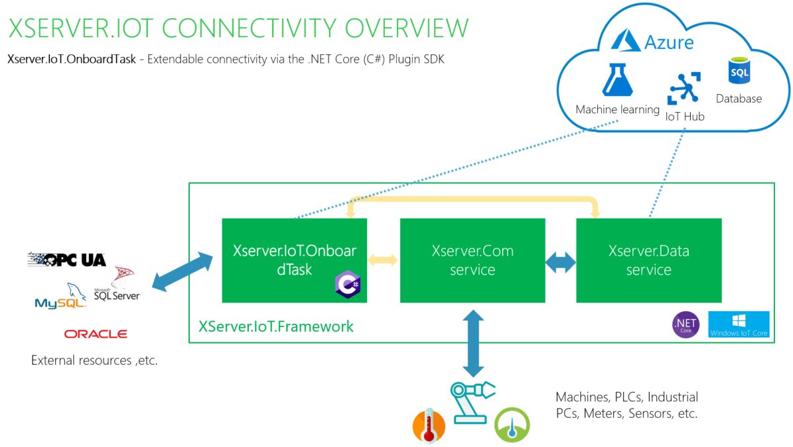
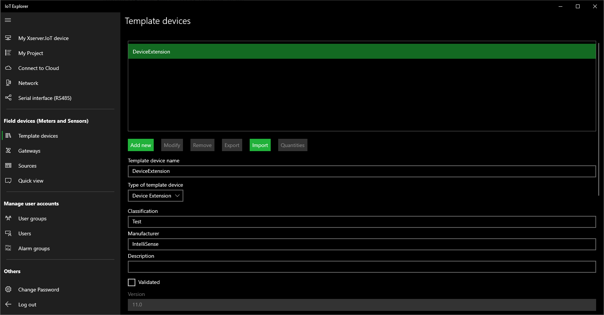
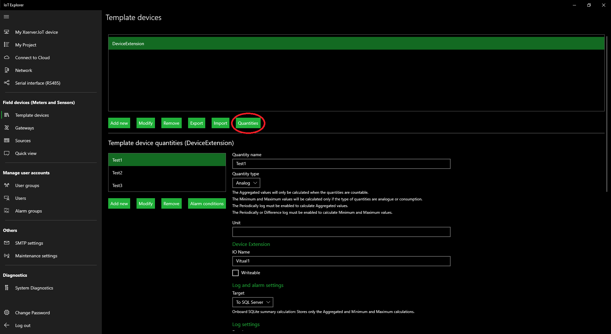
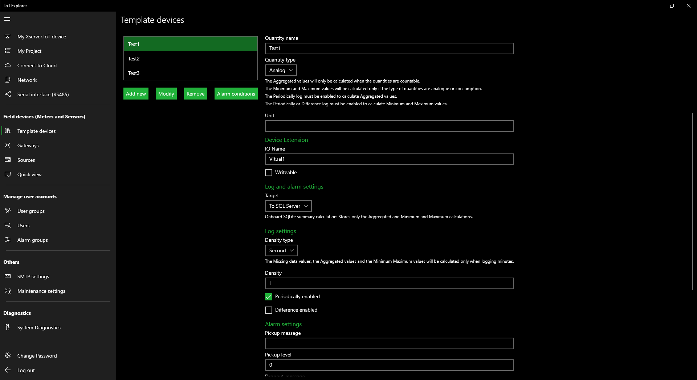
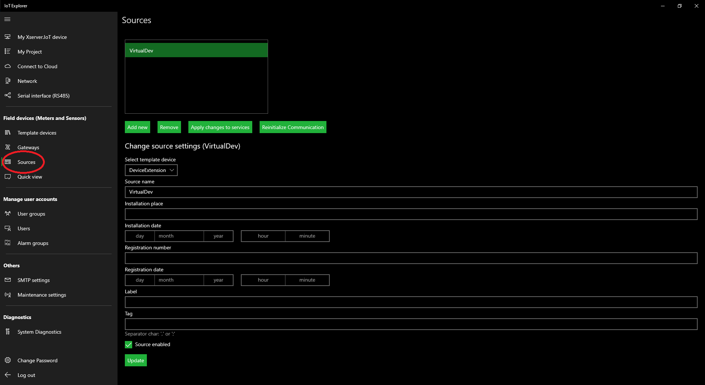
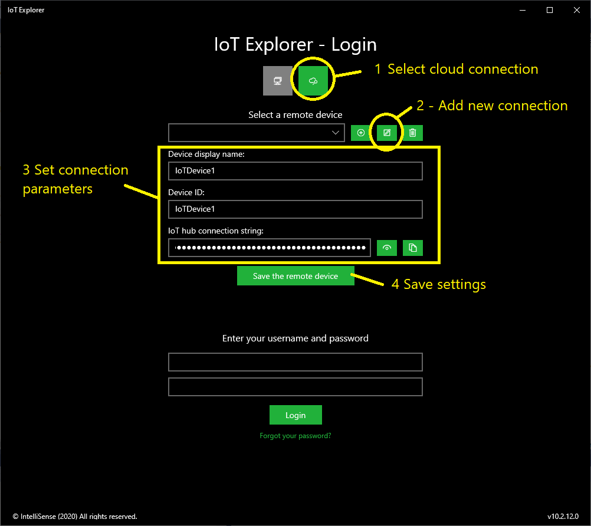
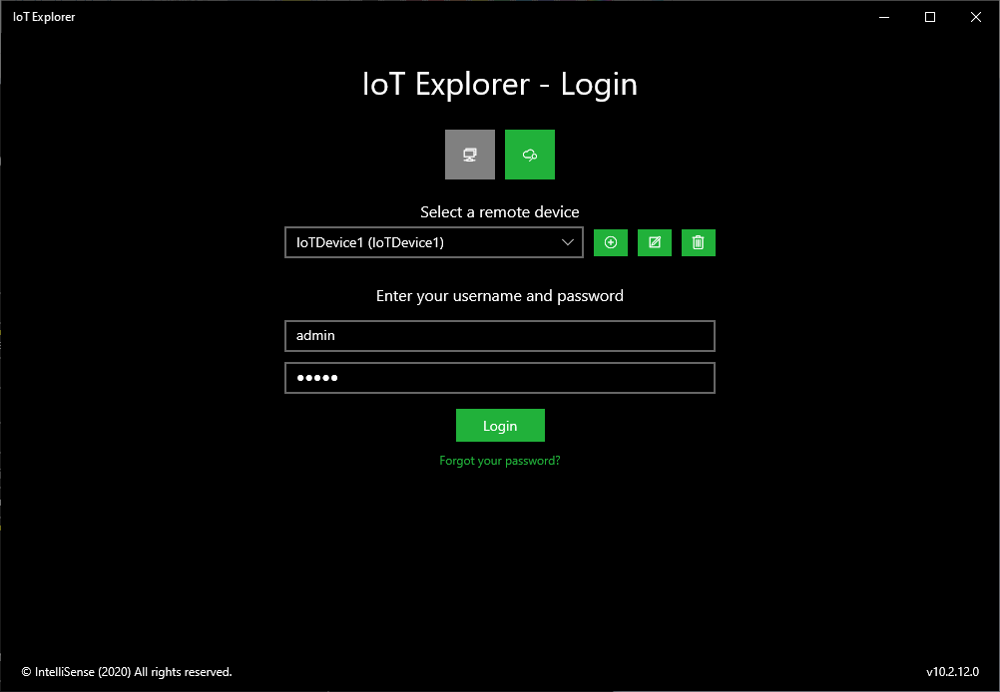
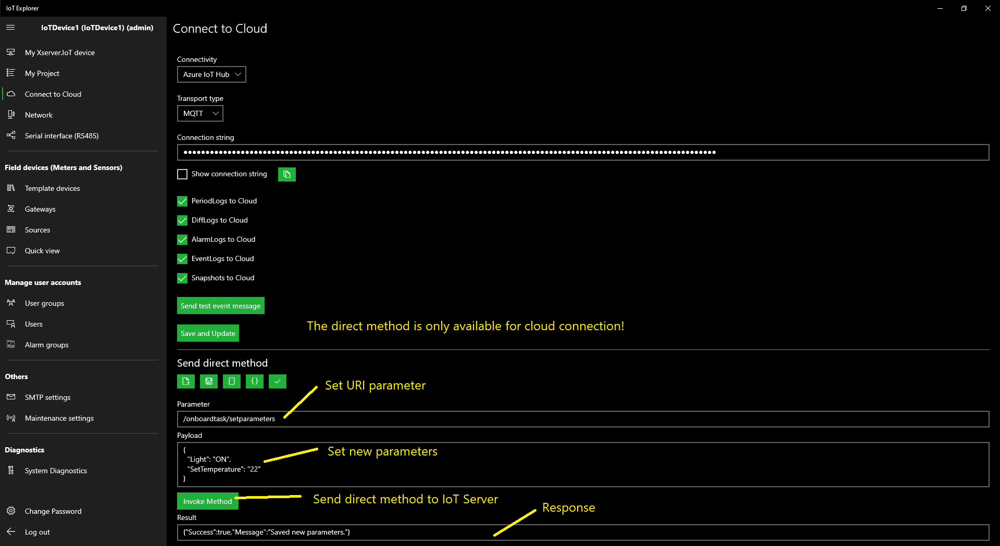
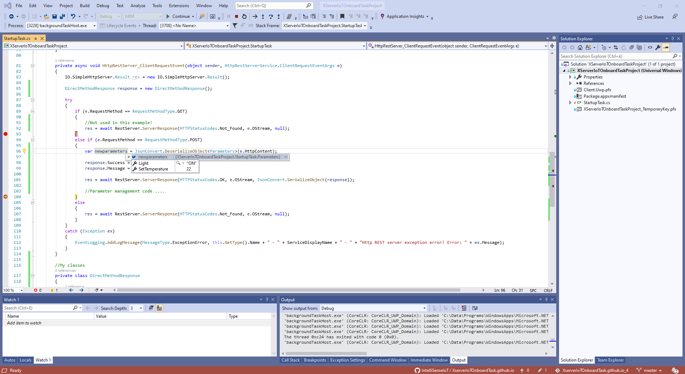

# Introduction:

Xserver.IoT.Framework can easily manage data from field devices to Cloud and SQL server applications. Field devices include meters, sensors, PLCs, trip units, motor controls, and other devices.
This capability allows the use of reporting, analysis and AI software (Machine Learning, Power BI, SAP, Energy Management, Smart City software, etc.) to access information from devices for data collection, trending, alarm/event management, analysis, and other functions.

- More details: https://www.intellisense-iot.com/
- Technical overview: https://www.youtube.com/watch?v=_fmbNuYwyqE&list=UUcLou6GZjtQRWgN1ukcglpg&index=14        
- Nugets: https://www.nuget.org/packages/XserverIoTCommon/

## Cloning the project with Visual Studio 2019 - No certificate found with the supplied thumbprint

    Solution:
    
    Right click the project -> Properties -> Package Manifest
    On the Package.appxmanifest go to Packaging tab -> Choose Certificate
    In the new window click "Select a Certificate..." if you have one, or create a certificate if you haven't created one

More details: https://stackoverflow.com/questions/57578299/uwp-no-certificate-found-with-the-supplied-thumbprint
    
# XserverIoTOnboardTask:

## Required UWP Target settings:

    Min version: Windows 10 Fall Creators Update (10.0; Build 16299) 

## Required Xserver.IoT firmware

    Min version: 10.2

## Required UWP Capabilities:

    <Capability Name="internetClient" />
    <Capability Name="internetClientServer"/>
    <Capability Name="privateNetworkClientServer"/>

## Before use app, enable loopback on the Windows 10 IoT Core (Before version 10.2):

    [More details...](https://github.com/IntelliSenseIoT/XserverIoTOnboardTask.github.io/blob/master/Enable%20loopback%20on%20the%20Windows%2010%20IoT%20Core.md)
    
## Example 1 (Real-time):

        #region Helpers
        //.....
        Realtime RObj = new Realtime();
        #endregion

        private static BackgroundTaskDeferral _Deferral = null;
        public void Run(IBackgroundTaskInstance taskInstance)
        {
            _Deferral = taskInstance.GetDeferral();

            EventLogging.Initialize();
            EventLogging.AddLogMessage(MessageType.Info, this.GetType().Name + " - " + ServiceDisplayName + " - " + "Start initializing...");

            //Todo: Before use this code, enable loopback in Windows 10 IoT Core: checknetisolation loopbackexempt -a -n='XServerIoTOnboardTaskProject-uwp_39mgpzy4q2jkm'
          
            Init();
        }
        private async void Init()      //Initialize service
        {
            bool error = false;

            #region Login to Xserver.IoT Service
            var res = await Authentication.Login("operator", "operator");
            if (res.Success == false)
            {
                EventLogging.AddLogMessage(MessageType.Error, this.GetType().Name + " - " + ServiceDisplayName + " - " + res.ErrorMessage);
                error = true;
            }
            #endregion

            #region Gets List of Sources and Quantities
            var result = await RObj.GetSourcesQuantities();
            if (result.Success == false)
            {
                EventLogging.AddLogMessage(MessageType.Error, this.GetType().Name + " - " + ServiceDisplayName + " - " + result.ErrorMessage);
                error = true;
            }
            #endregion

            #region Initialize and Start IoT OnboardTask
            OnboardTaskHandler.WaitingTime = TaskHandlerPeriod;
            OnboardTaskHandler.ThresholdReached += OnboardTask;
            OnboardTaskHandler.Run();
            #endregion

            EventLogging.AddLogMessage(MessageType.Info, this.GetType().Name + " - " + ServiceDisplayName + " - " + "Finished initialization.");
        }
       
        /// IoT Onboard Task
        private async void OnboardTask(object sender, EventArgs e)
        {
            try
            {
                //Todo: Type your onboard task code here

                var Light = await RObj.GetValue("Compressor", "Run");

                var Status =await  RObj.GetValue("Compressor", "Valve - Status");

                if (Light.Value >0 && Status.Value !=1)
                {
                    var writeresult = await RObj.WriteValue("Compressor", "Valve - Status", 1);
                }
            }
            catch (Exception ex)
            {
                EventLogging.AddLogMessage(MessageType.ExceptionError, this.GetType().Name + " - " + ServiceDisplayName + " - " + "OnboardTask exception error! Error: " + ex.Message);
            }
            OnboardTaskHandler.Run();  //Task continues to run
        }

## Example 2 (OPCUA communication):

Test OPCUA server in example: OPC UA Simulator Server (www.prosysopc.com)
    
        //First step add OPCUA.Library nuget to your project

        using OPCUA.Library;

        #region Helpers
        //.....
        Realtime RObj = new Realtime();
        OPCUAClient OPCUAClient = new OPCUAClient();
        #endregion

        private static BackgroundTaskDeferral _Deferral = null;
        public void Run(IBackgroundTaskInstance taskInstance)
        {
            _Deferral = taskInstance.GetDeferral();

            EventLogging.Initialize();
            EventLogging.AddLogMessage(MessageType.Info, this.GetType().Name + " - " + ServiceDisplayName + " - " + "Start initializing...");

            //Todo: Before use this code, enable loopback in Windows 10 IoT Core: checknetisolation loopbackexempt -a -n='XServerIoTOnboardTaskProject-uwp_39mgpzy4q2jkm'
          
            Init();
        }
        private async void Init()      //Initialize service
        {
            bool error = false;

            #region Login to Xserver.IoT Service
            var res = await Authentication.Login("operator", "operator");
            if (res.Success == false)
            {
                EventLogging.AddLogMessage(MessageType.Error, this.GetType().Name + " - " + ServiceDisplayName + " - " + res.ErrorMessage);
                error = true;
            }
            #endregion

            #region Gets List of Sources and Quantities
            var result = await RObj.GetSourcesQuantities();
            if (result.Success == false)
            {
                EventLogging.AddLogMessage(MessageType.Error, this.GetType().Name + " - " + ServiceDisplayName + " - " + result.ErrorMessage);
                error = true;
            }
            #endregion

            #region Connect to the OPCUA Server
            var certificateFile = await Package.Current.InstalledLocation.GetFileAsync(@"Client.Uwp.pfx");
            OPCUAClient.CertificateFilePath = certificateFile.Path;
            OPCUAClient.ServerAddress = "opc.tcp://COMPUTERNAME:53530/OPCUA/SimulationServer";
            var resopcua = OPCUAClient.Connect();
            if (resopcua.Success == false)
            {
                EventLogging.AddLogMessage(MessageType.Error, this.GetType().Name + " - " + ServiceDisplayName + " - " + resopcua.ErrorMessage);
                error = true;
            }
            #endregion

            #region Initialize and Start IoT OnboardTask
            OnboardTaskHandler.WaitingTime = TaskHandlerPeriod;
            OnboardTaskHandler.ThresholdReached += OnboardTask;
            OnboardTaskHandler.Run();
            #endregion

            EventLogging.AddLogMessage(MessageType.Info, this.GetType().Name + " - " + ServiceDisplayName + " - " + "Finished initialization.");
        }
       
        /// IoT Onboard Task
        private async void OnboardTask(object sender, EventArgs e)
        {
            try
            {
                //Todo: Type your onboard task code here
                
                //Reads OPCUA nodes example
                List<OPCReadNode> OPCNodes = new List<OPCReadNode>();

                OPCReadNode onenode = new OPCReadNode();

                onenode.Name = "Counter";
                onenode.NodeId = "ns=3;s=Counter";
                OPCNodes.Add(onenode);

                var result = OPCUAClient.ReadValues(OPCNodes);
            }
            catch (Exception ex)
            {
                EventLogging.AddLogMessage(MessageType.ExceptionError, this.GetType().Name + " - " + ServiceDisplayName + " - " + "OnboardTask exception error! Error: " + ex.Message);
            }
            OnboardTaskHandler.Run();  //Task continues to run
        }

## Example 3 (Real-time value(s) logging):

### Create Virtual Device:

### Code:

        #region Helpers
        //.....
        Realtime RObj = new Realtime();
        OPCUAClient OPCUAClient = new OPCUAClient();
        #endregion

        private static BackgroundTaskDeferral _Deferral = null;
        public void Run(IBackgroundTaskInstance taskInstance)
        {
            _Deferral = taskInstance.GetDeferral();

            EventLogging.Initialize();
            EventLogging.AddLogMessage(MessageType.Info, this.GetType().Name + " - " + ServiceDisplayName + " - " + "Start initializing...");

            //Todo: Before use this code, enable loopback in Windows 10 IoT Core: checknetisolation loopbackexempt -a -n='XServerIoTOnboardTaskProject-uwp_39mgpzy4q2jkm'
          
            Init();
        }
        private async void Init()      //Initialize service
        {
            bool error = false;

            #region Login to Xserver.IoT Service
            var res = await Authentication.Login("operator", "operator");
            if (res.Success == false)
            {
                EventLogging.AddLogMessage(MessageType.Error, this.GetType().Name + " - " + ServiceDisplayName + " - " + res.ErrorMessage);
                error = true;
            }
            #endregion

            #region Gets List of Sources and Quantities
            var result = await RObj.GetSourcesQuantities();
            if (result.Success == false)
            {
                EventLogging.AddLogMessage(MessageType.Error, this.GetType().Name + " - " + ServiceDisplayName + " - " + result.ErrorMessage);
                error = true;
            }
            #endregion

            #region Connect to the OPCUA Server
            var certificateFile = await Package.Current.InstalledLocation.GetFileAsync(@"Client.Uwp.pfx");
            OPCUAClient.CertificateFilePath = certificateFile.Path;
            OPCUAClient.ServerAddress = "opc.tcp://COMPUTERNAME:53530/OPCUA/SimulationServer";
            var resopcua = OPCUAClient.Connect();
            if (resopcua.Success == false)
            {
                EventLogging.AddLogMessage(MessageType.Error, this.GetType().Name + " - " + ServiceDisplayName + " - " + resopcua.ErrorMessage);
                error = true;
            }
            #endregion

            #region Initialize and Start IoT OnboardTask
            OnboardTaskHandler.WaitingTime = TaskHandlerPeriod;
            OnboardTaskHandler.ThresholdReached += OnboardTask;
            OnboardTaskHandler.Run();
            #endregion

            EventLogging.AddLogMessage(MessageType.Info, this.GetType().Name + " - " + ServiceDisplayName + " - " + "Finished initialization.");
        }
       
        /// IoT Onboard Task
        private async void OnboardTask(object sender, EventArgs e)
        {
            try
            {
                //Todo: Type your onboard task code here
                
                if (OPCUAClient.Connected == true)
                {
                    List<OPCReadNode> OPCNodes = new List<OPCReadNode>();

                    OPCReadNode onenode = new OPCReadNode();

                    onenode.Name = "Counter";
                    onenode.NodeId = "ns=3;s=Counter";
                    OPCNodes.Add(onenode);

                    var result = OPCUAClient.ReadValues(OPCNodes);

                    if (result.Success == true)
                    {
                        foreach (var item in result.OPCValues)
                        {
                            if (item.IsGood == true)
                            {
                                List<LogItem> LogItems = new List<LogItem>();

                                LogItem oneitem = new LogItem();

                                oneitem.SourceName = "VirtualDev";
                                oneitem.QuantityName = "Test1";

                                oneitem.Value = Convert.ToDouble(item.Value);

                                LogItems.Add(oneitem);

                                var resultlog = await RObj.PeriodicLogAddNewValues(LogItems);
                            }
                        }
                    }
                }
                else
                {
                    OPCUAClient.Connect();
                    if (OPCUAClient.Connected == false)
                    {
                        await Task.Delay(15000);
                    }
                }
            }
            catch (Exception ex)
            {
                EventLogging.AddLogMessage(MessageType.ExceptionError, this.GetType().Name + " - " + ServiceDisplayName + " - " + "OnboardTask exception error! Error: " + ex.Message);
            }
            OnboardTaskHandler.Run();  //Task continues to run
        }

## Example 4 (Direct Method trough Cloud connection)

### Add new IoT Device to IoT Explorer:

### Login

## Create direct method parameter

## Debug OnboardTask

### Code:

        //..... .   .
        private async void HttpRestServer_ClientRequestEvent(object sender, HttpRestServerService.ClientRequestEventArgs e)
        {
            IO.SimpleHttpServer.Result res = new IO.SimpleHttpServer.Result();

            DirectMethodResponse response = new DirectMethodResponse();

            try
            {
                if (e.RequestMethod == RequestMethodType.GET)
                {
                    //Not used in this example!
                    res = await RestServer.ServerResponse(HTTPStatusCodes.Not_Found, e.OStream, null);
                }
                else if (e.RequestMethod == RequestMethodType.POST)
                {
                    var newparameters = JsonConvert.DeserializeObject<Parameters>(e.HttpContent);

                    response.Success = true;
                    response.Message = "Saved new parameters.";

                    res = await RestServer.ServerResponse(HTTPStatusCodes.OK, e.OStream, JsonConvert.SerializeObject(response));

                    //Parameter management code ....
                }
                else
                {
                    res = await RestServer.ServerResponse(HTTPStatusCodes.Not_Found, e.OStream, null);
                }
            }
            catch (Exception ex)
            {
                EventLogging.AddLogMessage(MessageType.ExceptionError, this.GetType().Name + " - " + ServiceDisplayName + " - " + "Http REST server exception error! Error: " + ex.Message);
            }
        }

        //My classes
        private class DirectMethodResponse
        {
            public bool Success { get; set; }
            public string Message { get; set; }
        }

        private class Parameters
        {
            public string Light { get; set; }
            public double SetTemperature { get; set; }
        }
