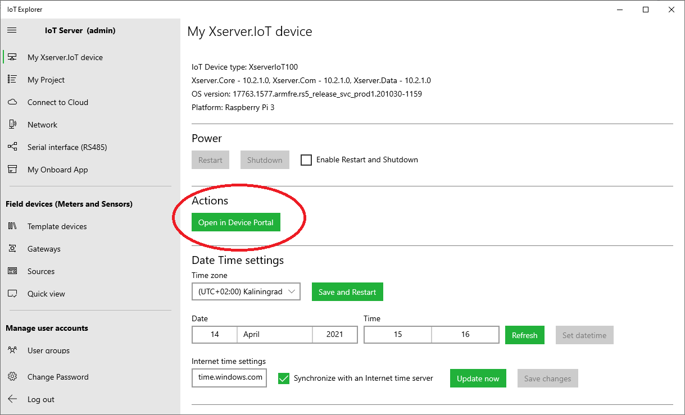
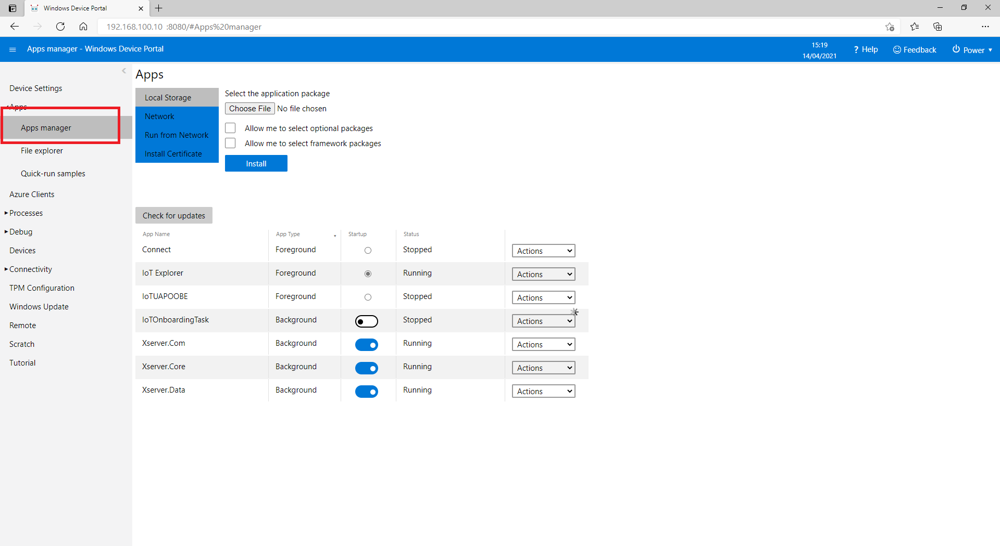
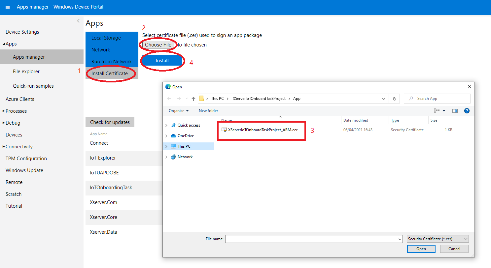
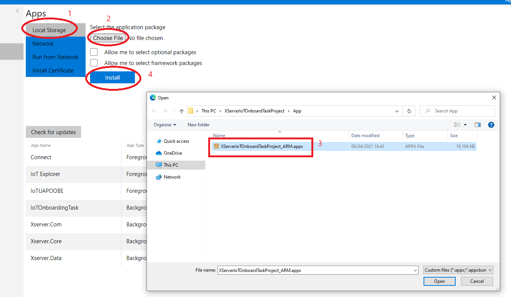
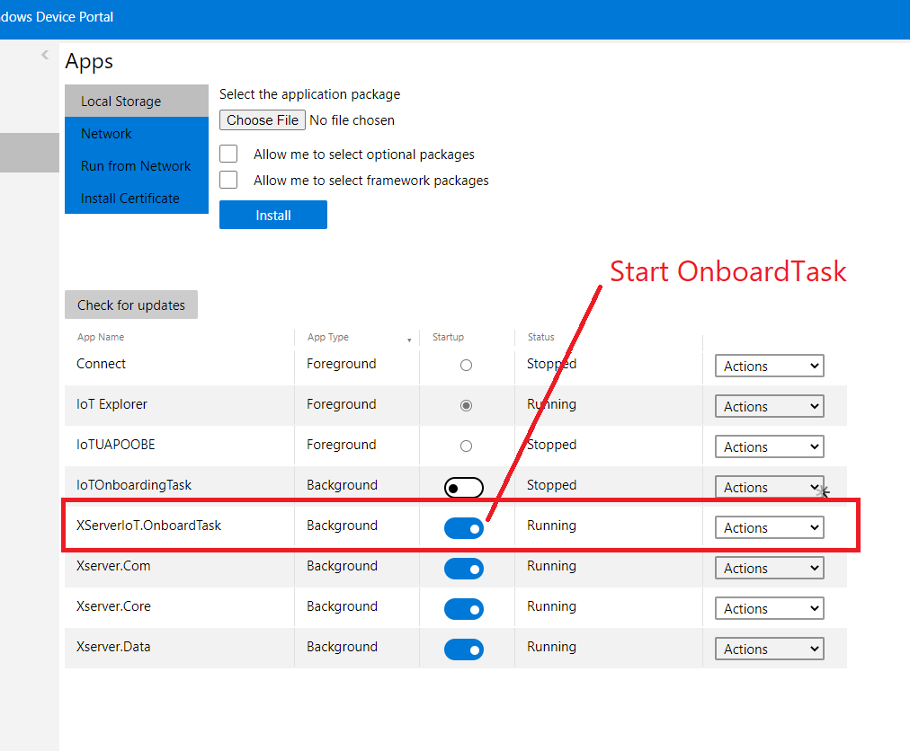

# Upload your OnboardTask app on IoT Server Device Portal

1) Open and Login to IoT Server with IoT Explorer

[Microsoft Tutorial: Debug UWP apps on remote machines from Visual Studio](https://docs.microsoft.com/en-us/visualstudio/debugger/run-windows-store-apps-on-a-remote-machine?view=vs-2019)
