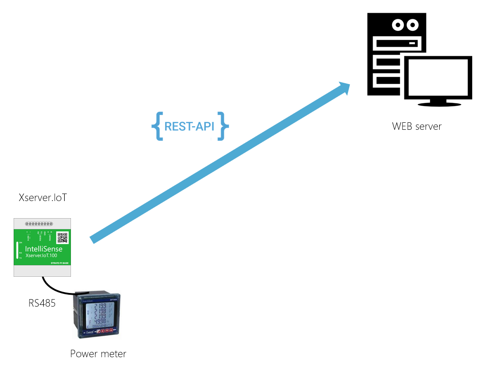

# Example 15 - IoT Server Rest API connection to Web Service

### The following example shows how to upload data from the onboard memory of an flow meter:

  - Upload historical data to the IoT server with onboardtask
  - Historical data log to SQL Server PeriodLog table
  - If the SQL server is not available, the data is stored in the onboard storage of the IoT Server
  - When the SQL server is reconnected, the data is uploaded from the onboard storage to the SQL server.

### Prerequisites:

  - Installed SQL Server 2019 Express (Create empty IoT Server database)
  - IoT Server connects to Flow meter on RS485 serial cable
  - Configure IoT Server with IoT Explorer
  
## Example:

In the example below, we upload data (hourly, 8 hours, daily, monthly) from a Modbus flow meter (connected to IoT Server via RS485) and log the data to an SQL server (we gets from connection string from IoT Explorer settings). If the connection to the SQL server is lost, the data is temporarily stored in the Onboard storage.
