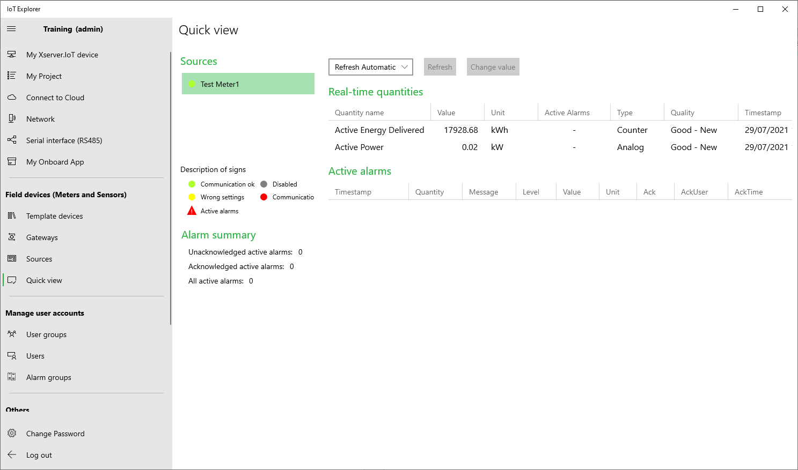

# Example 15 - IoT Server Rest API connection to Web Service

### Prerequisites:

  - IoT Server connects to one meter on RS485 serial or TCP/IP connection
  - Configure IoT Server with IoT Explorer

  
## Example:

The following example shows how to send data from Power Meter with IoT Server to Web service
