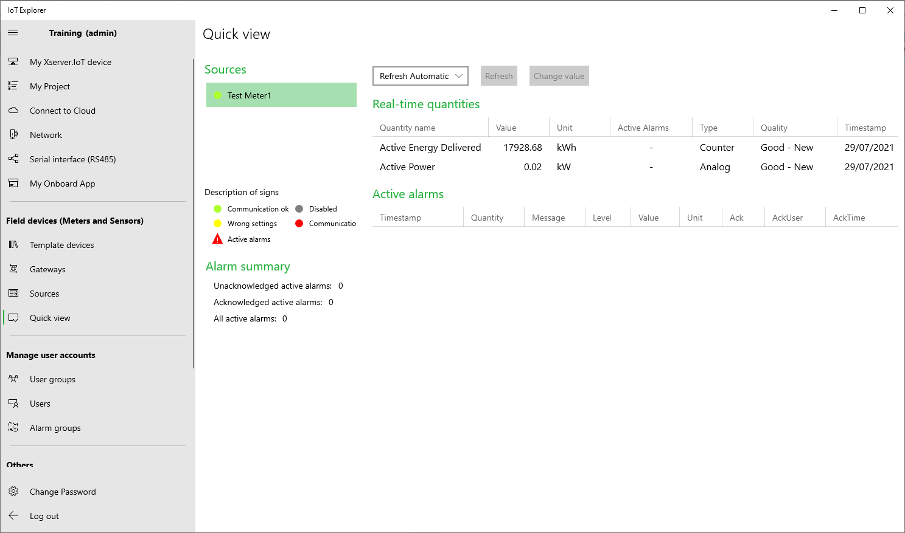

# Example 16 - Custom Serial communication (RS485)

### Prerequisites:

  - IoT Server connects to one serial device on RS485
  - Configure IoT Server with IoT Explorer
    - Create Onboard Task user group and add onboardtask user 

  
## Example:

The following example shows how to send data from Power Meter with IoT Server to Web service

## Code:

        #region XServerIoTOnboardTask service settings
        .....
        //Task Handler Period (ms)
        private const int TaskHandlerPeriod = 60000;  //1 Minute
        #endregion

        #region Helpers
        ....
        Realtime RObj = new Realtime();
        XserverIoTCommon.RestClient RestAPIClient = new XserverIoTCommon.RestClient();
        #endregion

        ....
        
        public async void Run(IBackgroundTaskInstance taskInstance)
        {
          
            ....

            #region Login to Xserver.IoT Service
            var res = await Authentication.Login("onboardtask", "onboardtask");
            if (res.Success == false)
            {
                EventLogging.AddLogMessage(MessageType.Error, this.GetType().Name + " - " + ServiceDisplayName + " - " + res.ErrorMessage);
            }
            #endregion

            #region Gets List of Sources and Quantities
            var result = await RObj.GetSourcesQuantities();
            if (result.Success == false)
            {
                EventLogging.AddLogMessage(MessageType.Error, this.GetType().Name + " - " + ServiceDisplayName + " - " + result.ErrorMessage);
            }
            #endregion

            #region Initialize RestClient to Website
            RestAPIClient.Username = "YourUsername";
            RestAPIClient.Password = "YourPassword";
            RestAPIClient.uriString = "http://<your web service uri>/";
            RestAPIClient.RestClientInitialize();
            #endregion

            .....
        }

        /// 

        /// IoT Onboard Task
        /// 

        /// <param name="sender"></param>
        /// <param name="e"></param>
        private async void OnboardTask(object sender, EventArgs e)
        {
            try
            {
                var RealtimeMeterValue = await RObj.GetValue("Test Meter1", "Active Power");

                if (RealtimeMeterValue.Quality != Models.Com.Common.Quality.None)
                {
                    List<MeterData> MetersData = new List<MeterData>();

                    MeterData OneMeterData = new MeterData();
                    OneMeterData.SourceName = RealtimeMeterValue.SourceName;
                    OneMeterData.QuantityName = RealtimeMeterValue.QuantityName;
                    OneMeterData.Unit = RealtimeMeterValue.Unit;
                    OneMeterData.Value = RealtimeMeterValue.Value;
                    OneMeterData.TimestampLT = RealtimeMeterValue.TimestampLT;

                    MetersData.Add(OneMeterData);

                    var result = await RestAPIClient.RestClientPOST("/meter", MetersData);
                    if (result.Success == true)
                    {
                        //Sent OK
                    }
                    else
                    {
                        EventLogging.AddLogMessage(MessageType.Error, this.GetType().Name + " - " + ServiceDisplayName + " - " + "REST API request: /meter - Error: " + result.ErrorMessage);
                    }
                }
            }
            catch (Exception ex)
            {
                EventLogging.AddLogMessage(MessageType.ExceptionError, this.GetType().Name + " - " + ServiceDisplayName + " - " + "OnboardTask exception error! Error: " + ex.Message);
            }
            OnboardTaskHandler.Run();  //Task continues to run
        }

        #region RestAPI objects
        private class MeterData
        {
            public string SourceName { get; set; }
            public string QuantityName { get; set; }
            public string Unit { get; set; }
            public double Value { get; set; }
            public DateTime TimestampLT { get; set; }
        }
        #endregion
