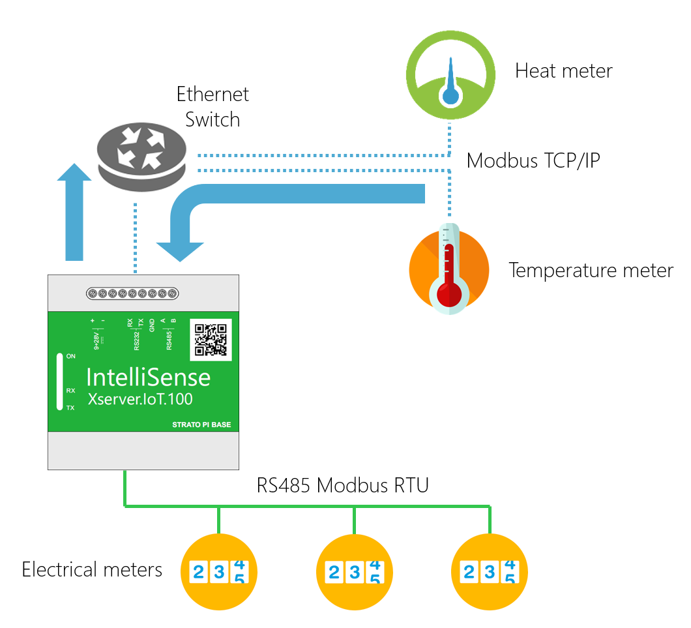

## Example 1 (Real-time - Access Sources and Quantites):

FRom OnboardTask supports to read and write the Quantites of Sources with realtime methods of [XserverIoTCommon API](https://github.com/IntelliSenseIoT/XserverIoTOnboardTask.github.io/blob/master/XserverIoTCommon.md).

### Code:

        #region Helpers
        //.....
        Realtime RObj = new Realtime();
        #endregion

        private static BackgroundTaskDeferral _Deferral = null;
        public void Run(IBackgroundTaskInstance taskInstance)
        {
            _Deferral = taskInstance.GetDeferral();

            EventLogging.Initialize();
            EventLogging.AddLogMessage(MessageType.Info, this.GetType().Name + " - " + ServiceDisplayName + " - " + "Start initializing...");

            Init();
        }
        private async void Init()      //Initialize service
        {
            bool error = false;

            #region Login to Xserver.IoT Service
            var res = await Authentication.Login("operator", "operator");
            if (res.Success == false)
            {
                EventLogging.AddLogMessage(MessageType.Error, this.GetType().Name + " - " + ServiceDisplayName + " - " + res.ErrorMessage);
                error = true;
            }
            #endregion

            #region Gets List of Sources and Quantities
            var result = await RObj.GetSourcesQuantities();
            if (result.Success == false)
            {
                EventLogging.AddLogMessage(MessageType.Error, this.GetType().Name + " - " + ServiceDisplayName + " - " + result.ErrorMessage);
                error = true;
            }
            #endregion

            #region Initialize and Start IoT OnboardTask
            OnboardTaskHandler.WaitingTime = TaskHandlerPeriod;
            OnboardTaskHandler.ThresholdReached += OnboardTask;
            OnboardTaskHandler.Run();
            #endregion

            EventLogging.AddLogMessage(MessageType.Info, this.GetType().Name + " - " + ServiceDisplayName + " - " + "Finished initialization.");
        }
       
        /// IoT Onboard Task
        private async void OnboardTask(object sender, EventArgs e)
        {
            try
            {
                //Reads values
                var Light = await RObj.GetValue("Compressor", "Run");

                var Status =await  RObj.GetValue("Compressor", "Valve - Status");

                if (Light.Value >0 && Status.Value !=1)
                {
                    //Writes values
                    var writeresult = await RObj.WriteValue("Compressor", "Valve - Status", 1);
                }
            }
            catch (Exception ex)
            {
                EventLogging.AddLogMessage(MessageType.ExceptionError, this.GetType().Name + " - " + ServiceDisplayName + " - " + "OnboardTask exception error! Error: " + ex.Message);
            }
            OnboardTaskHandler.Run();  //Task continues to run
        }
