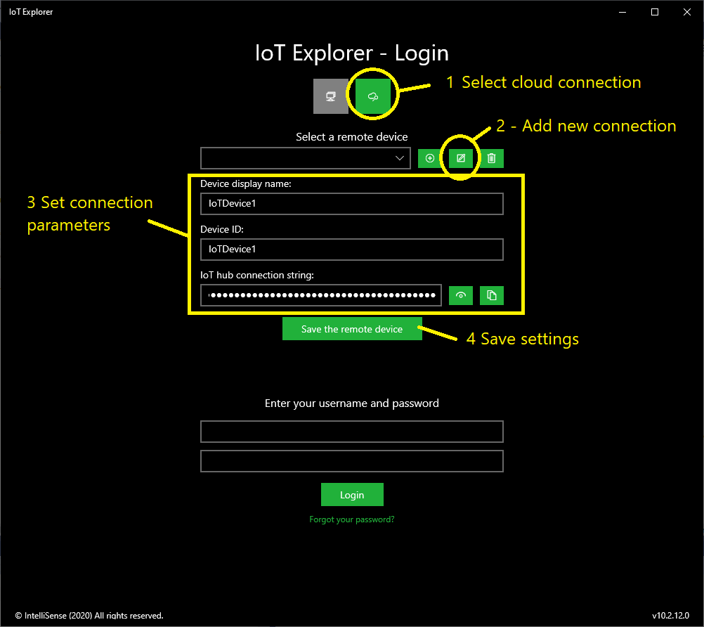

## Example 4 - Onboard Task and Azure Direct Method

### Add new IoT Device to IoT Explorer:

### Login

## Create direct method parameter

## Debug OnboardTask

### Code:

        //..... .   .
        private async void HttpRestServer_ClientRequestEvent(object sender, HttpRestServerService.ClientRequestEventArgs e)
        {
            IO.SimpleHttpServer.Result res = new IO.SimpleHttpServer.Result();

            DirectMethodResponse response = new DirectMethodResponse();

            try
            {
                if (e.RequestMethod == RequestMethodType.GET)
                {
                    //Not used in this example!
                    res = await RestServer.ServerResponse(HTTPStatusCodes.Not_Found, e.OStream, null);
                }
                else if (e.RequestMethod == RequestMethodType.POST)
                {
                    var newparameters = JsonConvert.DeserializeObject<Parameters>(e.HttpContent);

                    response.Success = true;
                    response.Message = "Saved new parameters.";

                    res = await RestServer.ServerResponse(HTTPStatusCodes.OK, e.OStream, JsonConvert.SerializeObject(response));

                    //Parameter management code ....
                }
                else
                {
                    res = await RestServer.ServerResponse(HTTPStatusCodes.Not_Found, e.OStream, null);
                }
            }
            catch (Exception ex)
            {
                EventLogging.AddLogMessage(MessageType.ExceptionError, this.GetType().Name + " - " + ServiceDisplayName + " - " + "Http REST server exception error! Error: " + ex.Message);
            }
        }

        //My classes
        private class DirectMethodResponse
        {
            public bool Success { get; set; }
            public string Message { get; set; }
        }

        private class Parameters
        {
            public string Light { get; set; }
            public double SetTemperature { get; set; }
        }
