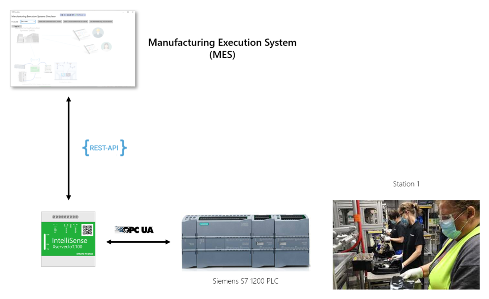

# Example 5 - MES & Siemens S7 PLC OPC UA connection

## Aditional resources

- [Case study technical overview](https://1drv.ms/p/s!AguHARCrYGJQgTZzJCJjAb-esjRo?e=uet5rg)
- [MES Simulator](https://github.com/IntelliSenseIoT/MES-Simulator-for-test)
- [Siemens S7 OPC UA Simulator](https://github.com/IntelliSenseIoT/Siemens-S7-OPCUA-Simulator)
- [IoT Server technical tedails](https://www.intellisense-iot.com/)
- [OPC UA Simulator download](https://downloads.prosysopc.com/opc-ua-simulation-server-downloads.php)

## REST API interface of the IoT Server

	HttpServerPort = "8010";
	HttpServerUserName = "MES";
	HttpServerPassword = "P@ssword";

POST Requests:

    Gets status of assembly station
    URI: /iotserver/getstatus
    Method: POST
    Request GetStatusRequest object
    Response: GetStatusAnswer object
    HTTP status code: 200 OK

    The starting signal from MES
    URI: /iotserver/start
    Method: POST
    Request ProcessStart object
    Response: Answer object
    HTTP status code: 200 OK

    Cancel the process
    URI: /iotserver/cancel
    Method: POST
    Request ProcessCancel object
    Response: Answer object
    HTTP status code: 200 OK

## REST API interface of the MES

    HttpServerPort = "8011";
	HttpServerUserName = "MES";
	HttpServerPassword = "P@ssword";

POST Requests:

    Send production data
    URI: /mes/productreport
    Method: POST
    Request ProcessCompleted object
    Response: null object
    HTTP status code: 200 OK

## Code:

    namespace XServerIoTOnboardTaskProject
    {
        public sealed class StartupTask : IBackgroundTask
        {
            #region XServerIoTOnboardTask service settings
            //Service display name
            private const string ServiceDisplayName = "Xserver.OnboardTask";
            //Task Handler Period (ms)
            private const int TaskHandlerPeriod = 2000;
            //Rest Server setting to MES communication
            private const string HttpServerPort = "8010";
            private const string HttpServerUserName = "MES";
            private const string HttpServerPassword = "P@ssword";
            private const string OPCConnectionString = "opc.tcp://<opc simulator ip>:53530/OPCUA/SimulationServer";
            private const string StationID = "Station 1";
            #endregion

            #region Helpers
            TaskHandler OnboardTaskHandler = new TaskHandler();
            HttpRestServerService RestServer = new HttpRestServerService();
            XserverIoTCommon.RestClient RestAPIClientMES = new XserverIoTCommon.RestClient();
            HttpServer HttpRestServerForExtApp = new HttpServer();
            OPCUAClient OPCUAClient = new OPCUAClient();
            #endregion

            //MES variables
            bool MESStart = false;

            private static BackgroundTaskDeferral _Deferral = null;

            public async void Run(IBackgroundTaskInstance taskInstance)
            {
                _Deferral = taskInstance.GetDeferral();

                EventLogging.Initialize();
                EventLogging.AddLogMessage(MessageType.Info, this.GetType().Name + " - " + ServiceDisplayName + " - " + "Start initializing...");

                //Initialize Http REST server
                await RestServer.HttpRESTServerStart();
                RestServer.ClientEvent += HttpRestServer_ClientRequestEvent;

                //Initialize Http REST server for MES communication
                var resrest = await StartRestServerForExtAppStart();

                //Initialize RestClient to MES
                RestAPIClientMES.Username = "MES";
                RestAPIClientMES.Password = "P@ssword";
                RestAPIClientMES.uriString = "http://<MES computer ip>:8011/";
                RestAPIClientMES.RestClientInitialize();

                var resopc = await ConnectToOpCServer();

                //Initialize and Start IoT OnboardTask
                OnboardTaskHandler.WaitingTime = TaskHandlerPeriod;
                OnboardTaskHandler.ThresholdReached += OnboardTask;
                OnboardTaskHandler.Run();

                EventLogging.AddLogMessage(MessageType.Info, this.GetType().Name + " - " + ServiceDisplayName + " - " + "Finished initialization.");
            }

            private async void OnboardTask(object sender, EventArgs e)
            {
                try
                {
                    if (MESStart == true)
                    {
                        List<OPCReadNode> OPCNodes = new List<OPCReadNode>();

                        OPCReadNode onenode4 = new OPCReadNode();
                        onenode4.Name = "Completed";
                        onenode4.NodeId = "ns=3;s=Completed";
                        OPCNodes.Add(onenode4);
                        OPCUAClient.ReadResult resultopc = new OPCUAClient.ReadResult();

                        resultopc = await OPCUAClient.ReadValues(OPCNodes);
                        if (resultopc.Success == true)
                        {
                            if (resultopc.OPCValues[0].IsGood == true && (double)resultopc.OPCValues[0].Value > 0)
                            {
                                MESStart = false;

                                List<OPCReadNode> ReadOPCNodes = new List<OPCReadNode>();

                                OPCReadNode onenode = new OPCReadNode();
                                onenode.Name = "DistanceMin";
                                onenode.NodeId = "ns=3;s=DistanceMin";
                                ReadOPCNodes.Add(onenode);

                                OPCReadNode onenode1 = new OPCReadNode();
                                onenode1.Name = "DistanceMax";
                                onenode1.NodeId = "ns=3;s=DistanceMax";
                                ReadOPCNodes.Add(onenode1);

                                OPCReadNode onenode2 = new OPCReadNode();
                                onenode2.Name = "TorqueMin";
                                onenode2.NodeId = "ns=3;s=TorqueMin";
                                ReadOPCNodes.Add(onenode2);

                                OPCReadNode onenode3 = new OPCReadNode();
                                onenode3.Name = "TorqueMax";
                                onenode3.NodeId = "ns=3;s=TorqueMax";
                                ReadOPCNodes.Add(onenode3);

                                OPCReadNode onenode5 = new OPCReadNode();
                                onenode5.Name = "Distance";
                                onenode5.NodeId = "ns=3;s=Distance";
                                ReadOPCNodes.Add(onenode5);

                                OPCReadNode onenode6 = new OPCReadNode();
                                onenode6.Name = "Torque";
                                onenode6.NodeId = "ns=3;s=Torque";
                                ReadOPCNodes.Add(onenode6);

                                OPCReadNode onenode7 = new OPCReadNode();
                                onenode7.Name = "Error";
                                onenode7.NodeId = "ns=3;s=Error";
                                ReadOPCNodes.Add(onenode7);

                                var resultreadopc = await OPCUAClient.ReadValues(ReadOPCNodes);
                                if (resultreadopc.Success == true)
                                {
                                    ProcessCompleted CompletedMessage = new ProcessCompleted();
                                    bool Good = true;
                                    foreach (var item in resultreadopc.OPCValues)
                                    {
                                        double value = (double)item.Value;
                                        if (Good == true)
                                        {
                                            Good = item.IsGood;
                                        }
                                        if (item.Name == "Error")
                                        {
                                            if (value == 0)
                                            {
                                                CompletedMessage.Error = false;
                                            }
                                            else
                                            {
                                                CompletedMessage.Error = true;
                                            }
                                        }
                                        else if (item.Name == "Distance")
                                        {
                                            CompletedMessage.Distance = value;
                                        }
                                        else if (item.Name == "DistanceMax")
                                        {
                                            CompletedMessage.DistanceMax = value;
                                        }
                                        else if (item.Name == "DistanceMin")
                                        {
                                            CompletedMessage.DistanceMin = value;
                                        }
                                        else if (item.Name == "Torque")
                                        {
                                            CompletedMessage.Torque = value;
                                        }
                                        else if (item.Name == "TorqueMax")
                                        {
                                            CompletedMessage.TorqueMax = value;
                                        }
                                        else if (item.Name == "TorqueMin")
                                        {
                                            CompletedMessage.TorqueMin = value;
                                        }
                                    }

                                    if (Good == true)
                                    {
                                        CompletedMessage.StationID = StationID;
                                        CompletedMessage.TimestampUTC = DateTime.UtcNow;

                                        var result = await RestAPIClientMES.RestClientPOST("/mes/productreport", CompletedMessage);
                                        if (result.Success == true)
                                        {
                                            EventLogging.AddLogMessage(MessageType.Info, this.GetType().Name + " - " + ServiceDisplayName + " - " + "REST API request: /mes/productreport");

                                            List<OPCWriteNode> OPCNodesC = new List<OPCWriteNode>();

                                            OPCWriteNode onenodewc1 = new OPCWriteNode();
                                            onenodewc1.Name = "Completed";
                                            onenodewc1.NodeId = "ns=3;s=Completed";
                                            onenodewc1.Value = 0.0;
                                            OPCNodesC.Add(onenodewc1);

                                            var resultwc1 = await OPCUAClient.WriteValues(OPCNodesC);

                                            if (resultwc1.Success == false)
                                            {
                                                EventLogging.AddLogMessage(MessageType.Info, this.GetType().Name + " - " + ServiceDisplayName + " - " + "Completed flag reset.");
                                            }
                                            else
                                            {
                                                EventLogging.AddLogMessage(MessageType.Error, this.GetType().Name + " - " + ServiceDisplayName + " - " + "Completed flag reset error! Error: " + resultwc1.ErrorMessage);
                                            }
                                        }
                                        else
                                        {
                                            EventLogging.AddLogMessage(MessageType.Error, this.GetType().Name + " - " + ServiceDisplayName + " - " + "REST API request: /mes/productreport - Error: "+ result.ErrorMessage);
                                        }
                                    }
                                }
                            }    
                        }
                    }
                }
                catch (Exception ex)
                {
                    EventLogging.AddLogMessage(MessageType.ExceptionError, this.GetType().Name + " - " + ServiceDisplayName + " - " + "OnboardTask exception error! Error: " + ex.Message);
                }
                OnboardTaskHandler.Run();  //Task continues to run
            }

            //Not used this example
            private async void HttpRestServer_ClientRequestEvent(object sender, HttpRestServerService.ClientRequestEventArgs e)
            {

                IO.SimpleHttpServer.Result res = new IO.SimpleHttpServer.Result();

                try
                {
                    if (e.RequestMethod == RequestMethodType.GET)
                    {
                        //Todo: Type your code here
                        // Example:
                        //if (e.uriString.ToLower() == "/onboardtask/examplegeturi")
                        //{
                        //    string content = JsonConvert.SerializeObject(YourObject);
                        //    res = await RestServer.ServerResponse(HTTPStatusCodes.OK, e.OStream, content);
                        //}
                    }
                    else if (e.RequestMethod == RequestMethodType.POST)
                    {
                        //Todo: Type your code here
                        // Example:
                        //if (e.uriString.ToLower() == "/onboardtask/exampleposturi")
                        //{  
                        //    YourObject MyObj = JsonConvert.DeserializeObject<YourObject>(e.HttpContent);
                        //    ....
                        //    string content = JsonConvert.SerializeObject(answer);
                        //    res = await RestServer.ServerResponse(HTTPStatusCodes.OK, e.OStream, content);
                        //}
                    }
                    else
                    {
                        res = await RestServer.ServerResponse(HTTPStatusCodes.Not_Found, e.OStream, null);
                    }
                }
                catch (Exception ex)
                {
                    EventLogging.AddLogMessage(MessageType.ExceptionError, this.GetType().Name + " - " + ServiceDisplayName + " - " + "Http REST server exception error! Error: " + ex.Message);
                }
            }

            #region Rest Server for MES communication
            private async Task<bool> StartRestServerForExtAppStart()
            {
                var result = await HttpRestServerForExtApp.StartServer(HttpServerPort);

                if (result.Success == true)
                {
                    EventLogging.AddLogMessage(MessageType.Info, this.GetType().Name + " - " + ServiceDisplayName + " - " + "Start HttpRestServerForExtApp.");
                    HttpRestServerForExtApp.ClientRequestEvent += HttpRestServerForExtApp_ClientRequestEvent;
                    return true;
                }
                else
                {
                    EventLogging.AddLogMessage(MessageType.Error, this.GetType().Name + " - " + ServiceDisplayName + " - " + "HttpRestServerForExtApp start no success!");
                    return false;
                }
            }
            private async void HttpRestServerForExtApp_ClientRequestEvent(object sender, ClientRequestEventArgs e)
            {
                IO.SimpleHttpServer.Result res = new IO.SimpleHttpServer.Result();

                try
                {
                    if (e.Authorization == AuthorizationType.Basic && e.UserName == HttpServerUserName && e.Password == HttpServerPassword)
                    {
                        if (e.RequestMethod == RequestMethodType.GET)
                        {
                            //....
                        }
                        else if (e.RequestMethod == RequestMethodType.POST)
                        {
                            if (e.uriString.ToLower() == "/iotserver/getstatus")
                            {
                                var GetStatusReq = JsonConvert.DeserializeObject<GetStatusRequest>(e.HttpContent);
                                EventLogging.AddLogMessage(MessageType.Info, this.GetType().Name + " - " + ServiceDisplayName + " - " + "REST API request: /iotserver/getstatus - MessageID:" + GetStatusReq.MessageID + " - TimeStampUTC:"+ GetStatusReq.TimestampUTC.ToString());

                                GetStatusAnswer Answer = new GetStatusAnswer();
                                Answer.MessageID = GetStatusReq.MessageID;
                                Answer.StationID = StationID;

                                //Reads OPCUA nodes example
                                List<OPCReadNode> OPCNodes = new List<OPCReadNode>();

                                OPCReadNode onenode1 = new OPCReadNode();
                                onenode1.Name = "Run";
                                onenode1.NodeId = "ns=3;s=Run";
                                OPCNodes.Add(onenode1);

                                OPCReadNode onenode3 = new OPCReadNode();
                                onenode3.Name = "Error";
                                onenode3.NodeId = "ns=3;s=Error";
                                OPCNodes.Add(onenode3);

                                OPCReadNode onenode4 = new OPCReadNode();
                                onenode4.Name = "Completed";
                                onenode4.NodeId = "ns=3;s=Completed";
                                OPCNodes.Add(onenode4);

                                OPCReadNode onenode5 = new OPCReadNode();
                                onenode5.Name = "ProcessStatus";
                                onenode5.NodeId = "ns=3;s=ProcessStatus";
                                OPCNodes.Add(onenode5);

                                OPCUAClient.ReadResult resultopc = new OPCUAClient.ReadResult();

                                resultopc = await OPCUAClient.ReadValues(OPCNodes);

                                if (resultopc.Success == true)
                                {
                                    bool Good = true;
                                    foreach (var item in resultopc.OPCValues)
                                    {
                                        double value = (double)item.Value;
                                        if (Good == true)
                                        {
                                            Good = item.IsGood;
                                        }
                                        if (item.Name == "Run")
                                        {
                                            if (value == 0)
                                            {
                                                Answer.Run = false;
                                            }
                                            else
                                            {
                                                Answer.Run = true;
                                            }
                                        }
                                        else if (item.Name == "Error")
                                        {
                                            if (value == 0)
                                            {
                                                Answer.Error = false;
                                            }
                                            else
                                            {
                                                Answer.Error = true;
                                            }
                                        }
                                        else if (item.Name == "Completed")
                                        {
                                            if (value == 0)
                                            {
                                                Answer.Completed = false;
                                            }
                                            else
                                            {
                                                Answer.Completed = true;
                                            }
                                        }
                                        else if (item.Name == "ProcessStatus")
                                        {
                                            Answer.ProcessStatus = Convert.ToInt32(value);
                                        }
                                    }
                                    Answer.Success = Good;
                                }
                                else
                                {
                                    Answer.Success = false;
                                }

                                Answer.TimestampUTC = DateTime.UtcNow;
                                string content = JsonConvert.SerializeObject(Answer);
                                res = await HttpRestServerForExtApp.ServerResponse(HTTPStatusCodes.OK, e.OStream, content);
                            }
                            else if (e.uriString.ToLower() == "/iotserver/start")
                            {
                                var StartObj = JsonConvert.DeserializeObject<ProcessStart>(e.HttpContent);
                                EventLogging.AddLogMessage(MessageType.Info, this.GetType().Name + " - " + ServiceDisplayName + " - " + "REST API request: /iotserver/start - MessageID:" + StartObj.MessageID + " - TimeStampUTC:" + StartObj.TimestampUTC.ToString());

                                Answer StartAnswer = new Answer();
                                StartAnswer.MessageID = StartObj.MessageID;
                                if (MESStart == true)
                                {
                                    StartAnswer.ErrorMessage = "Process is running!";
                                    StartAnswer.Success = false;
                                }
                                else
                                {
                                    MESStart = true;
                                    StartAnswer.Success = true;
                                }
                                StartAnswer.TimestampUTC = DateTime.UtcNow;

                                string content = JsonConvert.SerializeObject(StartAnswer);
                                res = await HttpRestServerForExtApp.ServerResponse(HTTPStatusCodes.OK, e.OStream, content);
                            }
                            else if (e.uriString.ToLower() == "/iotserver/cancel")
                            {
                                var CancelObj = JsonConvert.DeserializeObject<ProcessCancel>(e.HttpContent);
                                EventLogging.AddLogMessage(MessageType.Info, this.GetType().Name + " - " + ServiceDisplayName + " - " + "REST API request: /iotserver/cancel - MessageID:" + CancelObj.MessageID + " - TimeStampUTC:" + CancelObj.TimestampUTC.ToString());

                                Answer CancelAnswer = new Answer();
                                CancelAnswer.MessageID = CancelAnswer.MessageID;
                                MESStart = false;
                                CancelAnswer.Success = true;
                                CancelAnswer.TimestampUTC = DateTime.UtcNow;

                                string content = JsonConvert.SerializeObject(CancelAnswer);
                                res = await HttpRestServerForExtApp.ServerResponse(HTTPStatusCodes.OK, e.OStream, content);
                            }
                        }
                        else
                        {
                            res = await HttpRestServerForExtApp.ServerResponse(HTTPStatusCodes.Not_Found, e.OStream, null);
                        }
                    }
                    else
                    {
                        res = await HttpRestServerForExtApp.ServerResponse(HTTPStatusCodes.Unauthorized, e.OStream, null);
                    }
                }
                catch (Exception ex)
                {
                    EventLogging.AddLogMessage(MessageType.ExceptionError, this.GetType().Name + " - " + ServiceDisplayName + " - " + "HttpRestServerForExtApp error: " + ex.Message);
                }
            }
            #endregion

            #region OPC Server Functions 
            private async Task<bool> ConnectToOpCServer()
            {
                var certificateFile = await Package.Current.InstalledLocation.GetFileAsync(@"Client.Uwp.pfx");
                OPCUAClient.CertificateFilePath = certificateFile.Path;
                OPCUAClient.ServerAddress = OPCConnectionString;
                var resopcua = OPCUAClient.Connect();
                if (resopcua.Success == false)
                {
                    EventLogging.AddLogMessage(MessageType.Error, this.GetType().Name + " - " + ServiceDisplayName + " - " + "OPC Server connection is not successful! Error: "  + resopcua.ErrorMessage);
                    return false;
                }
                else
                {
                    EventLogging.AddLogMessage(MessageType.Info, this.GetType().Name + " - " + ServiceDisplayName + " - " + "OPC Server connection is successful.");
                    return true;
                }
            }
            #endregion

            #region RestAPI objects
            private class ProcessStart
            {
                public string MessageID { get; set; }
                public string ProductID { get; set; }
                public DateTime TimestampUTC { get; set; }
            }

            private class ProcessCancel
            {
                public string MessageID { get; set; }
                public DateTime TimestampUTC { get; set; }
            }

            private class Answer
            {
                public string MessageID { get; set; }
                public bool Success { get; set; }
                public string ErrorMessage { get; set; }
                public DateTime TimestampUTC { get; set; }
            }

            private class GetStatusRequest
            {
                public string MessageID { get; set; }
                public DateTime TimestampUTC { get; set; }
            }

            private class GetStatusAnswer
            {
                public string StationID { get; set; }
                public string MessageID { get; set; }
                public bool Success { get; set; }
                public DateTime TimestampUTC { get; set; }
                public bool Run { get; set; }
                public bool Error { get; set; }
                public bool Completed { get; set; }
                public int ProcessStatus { get; set; }
            }

            private class ProcessCompleted
            {
                public string StationID { get; set; }
                public DateTime TimestampUTC { get; set; }
                public bool Error { get; set; }
                public double DistanceMin { get; set; }
                public double DistanceMax { get; set; }
                public double Distance { get; set; }
                public double TorqueMin { get; set; }
                public double TorqueMax { get; set; }
                public double Torque { get; set; }
            }
            #endregion

        }
    }
