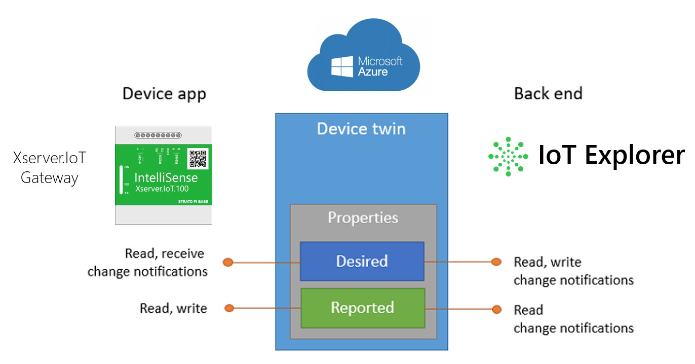
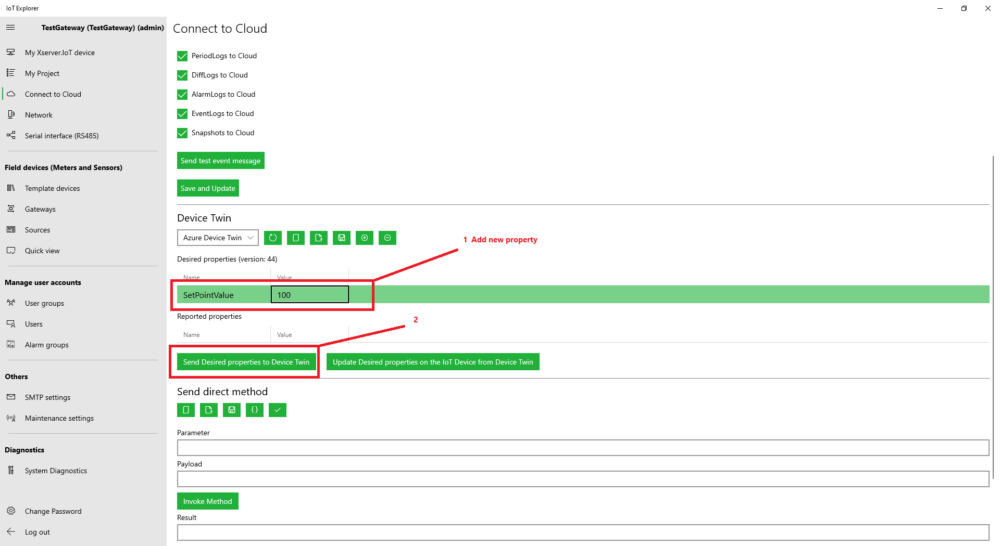
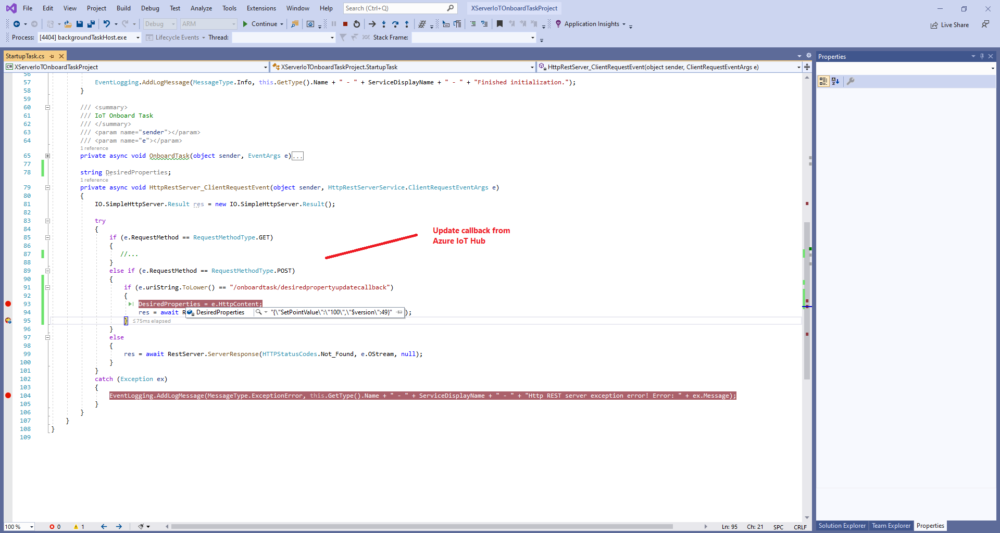

# Example 6 - Desired properties change callback 

In the example below, if the Desired properties change in the Cloud, we get an event from there in the OnboardTask.

## Code:

    namespace XServerIoTOnboardTaskProject
    {
            .....

            string DesiredProperties;
            private async void HttpRestServer_ClientRequestEvent(object sender, HttpRestServerService.ClientRequestEventArgs e)
            {
                IO.SimpleHttpServer.Result res = new IO.SimpleHttpServer.Result();

                try
                {
                    if (e.RequestMethod == RequestMethodType.GET)
                    {
                       //...
                    }
                    else if (e.RequestMethod == RequestMethodType.POST)
                    {
                        if (e.uriString.ToLower() == "/onboardtask/desiredpropertyupdatecallback")
                        {
                            DesiredProperties = e.HttpContent;
                            res = await RestServer.ServerResponse(HTTPStatusCodes.OK, e.OStream, null);
                        }
                    }
                    else
                    {
                        res = await RestServer.ServerResponse(HTTPStatusCodes.Not_Found, e.OStream, null);
                    }
                }
                catch (Exception ex)
                {
                    EventLogging.AddLogMessage(MessageType.ExceptionError, this.GetType().Name + " - " + ServiceDisplayName + " - " + "Http REST server exception error! Error: " + ex.Message);
                }
            }
        }
    }
