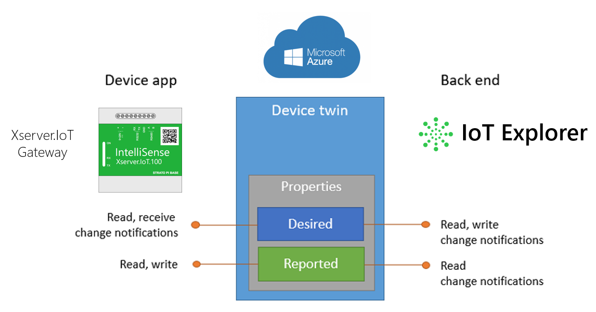

# Example 7 - Device twin management with IoT server

The example shows how to handle reported and desired properties with IoT Server.

## Code:

    namespace XServerIoTOnboardTaskProject
    {
            ....

            private async void HttpRestServer_ClientRequestEvent(object sender, HttpRestServerService.ClientRequestEventArgs e)
            {
                IO.SimpleHttpServer.Result res = new IO.SimpleHttpServer.Result();

                try
                {
                    if (e.RequestMethod == RequestMethodType.GET)
                    {
                        //...
                    }
                    else if (e.RequestMethod == RequestMethodType.POST)
                    {
                        if (e.uriString.ToLower() == "/onboardtask/desiredpropertyupdatecallback")
                        {
                            res = await RestServer.ServerResponse(HTTPStatusCodes.OK, e.OStream, null);

                            //Get Desired properties from Azure IoT Hub callback event
                            JObject jsonObj = JObject.Parse(e.HttpContent); 
                            Dictionary<string, string> DesiredPropertiesFromContent = jsonObj.ToObject<Dictionary<string, string>>();
                            
                            //Gets Desired properties from IoT Server Onboard storage
                            var DesiredPropertiesFromOnboard = await XserverIoTCommon.DeviceTwin.GetDesiredProperties();
                            //Information: DesiredPropertiesFromContent and DesiredPropertiesFromOnboard are equal, because UpdateCallBack event saves Desired properties into the Onboard storage also.

                            List<DeviceTwinProperty> NewReportedProperties = new List<DeviceTwinProperty>();

                            foreach (var item in DesiredPropertiesFromOnboard.DesiredProperties)
                            {
                                NewReportedProperties.Add(item);
                            }
                            //Saves New Reported properties into the Onboard storage and sends to Azure Device Twin also.
                            await XserverIoTCommon.DeviceTwin.SaveReportedProperties(NewReportedProperties);

                            //You can get saved reported properties from Onboard Storage
                            var checksavedReportedProperties = await XserverIoTCommon.DeviceTwin.GetReportedProperties();
                        }
                    }
                    else
                    {
                        res = await RestServer.ServerResponse(HTTPStatusCodes.Not_Found, e.OStream, null);
                    }
                }
                catch (Exception ex)
                {
                    EventLogging.AddLogMessage(MessageType.ExceptionError, this.GetType().Name + " - " + ServiceDisplayName + " - " + "Http REST server exception error! Error: " + ex.Message);
                }
            }
        }
    }
  
