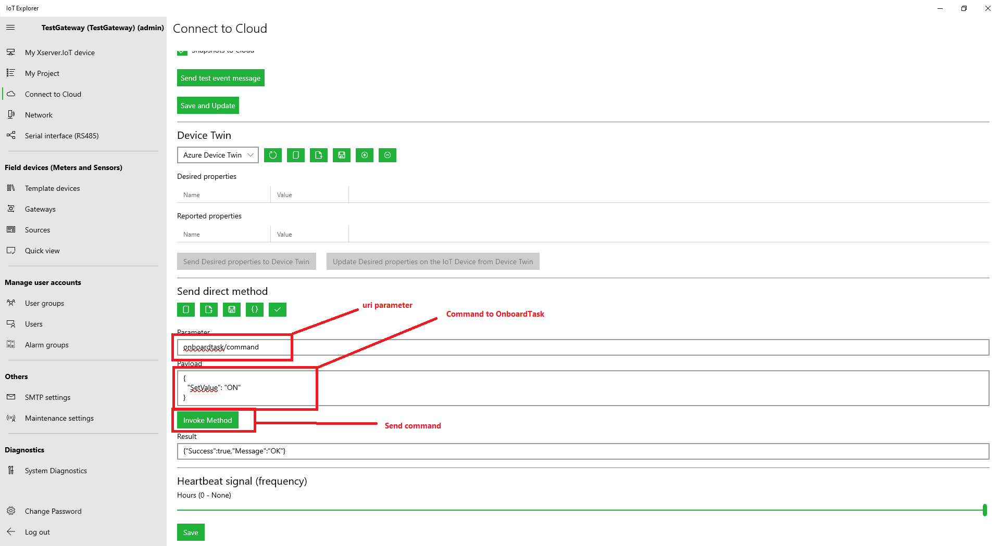

# Example 9 - Direct Method Command from IoT Explorer

## Code:

    namespace XServerIoTOnboardTaskProject
    {
            ....

            private async void HttpRestServer_ClientRequestEvent(object sender, HttpRestServerService.ClientRequestEventArgs e)
            {
                IO.SimpleHttpServer.Result res = new IO.SimpleHttpServer.Result();

                DirectMethodResponse response = new DirectMethodResponse();  //My command response object

                try
                {
                    if (e.RequestMethod == RequestMethodType.GET)
                    {
                        //...
                    }
                    else if (e.RequestMethod == RequestMethodType.POST)
                    {
                        if (e.uriString.ToLower() == "/onboardtask/command")
                        {
                            var newcommand = JsonConvert.DeserializeObject<Command>(e.HttpContent);

                            response.Success = true;
                            response.Message = "OK";

                            res = await RestServer.ServerResponse(HTTPStatusCodes.OK, e.OStream, JsonConvert.SerializeObject(response));

                            //Command management code ....
                        }
                    }
                    else
                    {
                        res = await RestServer.ServerResponse(HTTPStatusCodes.Not_Found, e.OStream, null);
                    }
                }
                catch (Exception ex)
                {
                    EventLogging.AddLogMessage(MessageType.ExceptionError, this.GetType().Name + " - " + ServiceDisplayName + " - " + "Http REST server exception error! Error: " + ex.Message);
                }
            }

            //My classes
            private class DirectMethodResponse
            {
                public bool Success { get; set; }
                public string Message { get; set; }
            }

            private class Command
            {
                public string SetValue { get; set; }
            }
        }
    }
