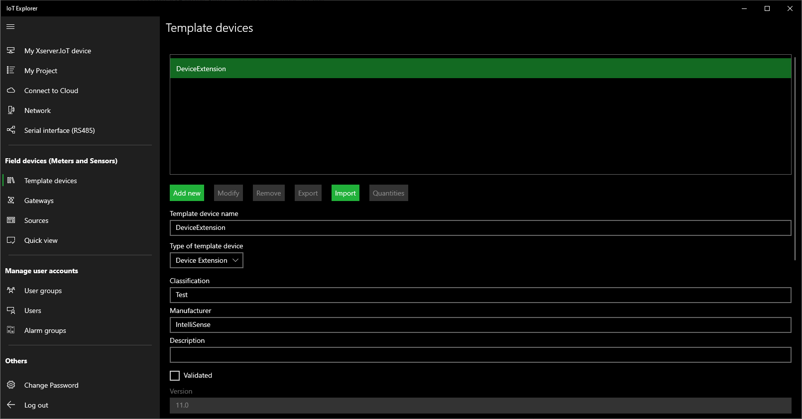
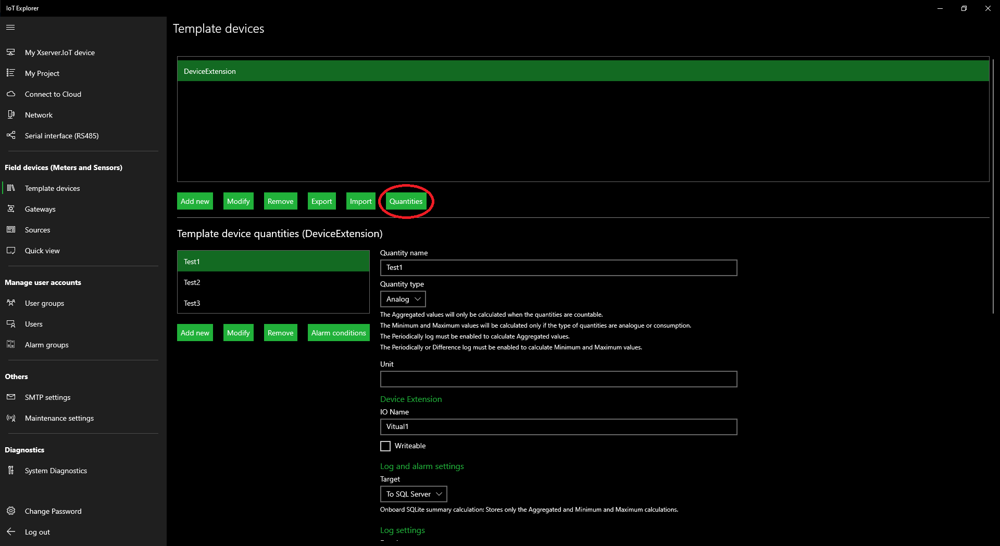
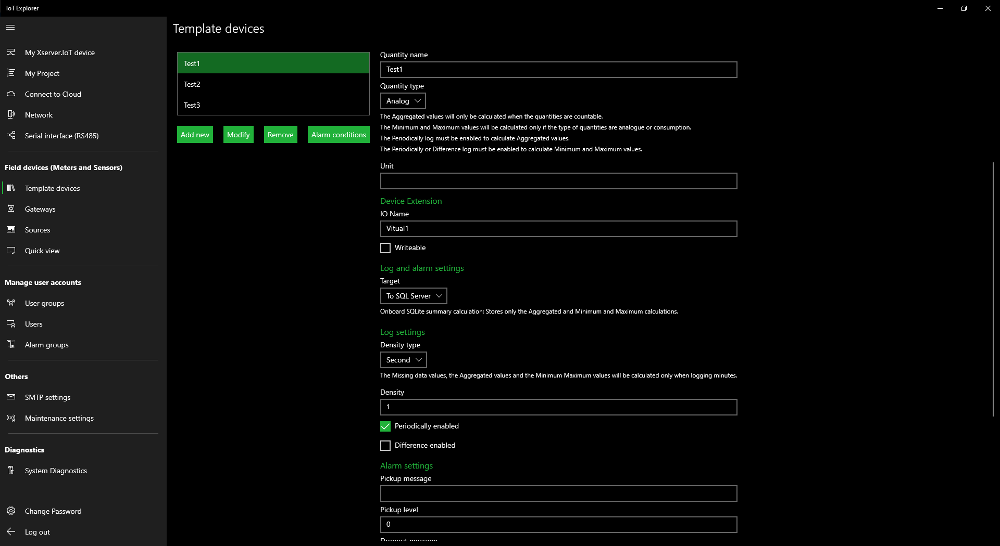
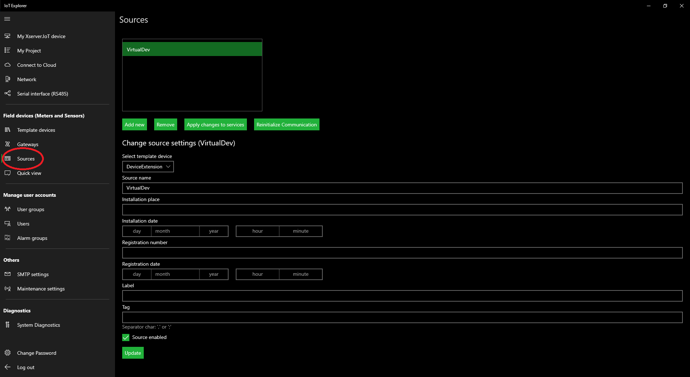

## Example 3 (OPC UA Real-time value(s) logging):

### Create Virtual Device:

### Code:

        #region Helpers
        //.....
        Realtime RObj = new Realtime();
        OPCUAClient OPCUAClient = new OPCUAClient();
        #endregion

        private static BackgroundTaskDeferral _Deferral = null;
        public void Run(IBackgroundTaskInstance taskInstance)
        {
            _Deferral = taskInstance.GetDeferral();

            EventLogging.Initialize();
            EventLogging.AddLogMessage(MessageType.Info, this.GetType().Name + " - " + ServiceDisplayName + " - " + "Start initializing...");

            Init();
        }
        private async void Init()      //Initialize service
        {
            bool error = false;

            #region Login to Xserver.IoT Service
            var res = await Authentication.Login("operator", "operator");
            if (res.Success == false)
            {
                EventLogging.AddLogMessage(MessageType.Error, this.GetType().Name + " - " + ServiceDisplayName + " - " + res.ErrorMessage);
                error = true;
            }
            #endregion

            #region Gets List of Sources and Quantities
            var result = await RObj.GetSourcesQuantities();
            if (result.Success == false)
            {
                EventLogging.AddLogMessage(MessageType.Error, this.GetType().Name + " - " + ServiceDisplayName + " - " + result.ErrorMessage);
                error = true;
            }
            #endregion

            #region Connect to the OPCUA Server
            var certificateFile = await Package.Current.InstalledLocation.GetFileAsync(@"Client.Uwp.pfx");
            OPCUAClient.CertificateFilePath = certificateFile.Path;
            OPCUAClient.ServerAddress = "opc.tcp://COMPUTERNAME:53530/OPCUA/SimulationServer";
            var resopcua = OPCUAClient.Connect();
            if (resopcua.Success == false)
            {
                EventLogging.AddLogMessage(MessageType.Error, this.GetType().Name + " - " + ServiceDisplayName + " - " + resopcua.ErrorMessage);
                error = true;
            }
            #endregion

            #region Initialize and Start IoT OnboardTask
            OnboardTaskHandler.WaitingTime = TaskHandlerPeriod;
            OnboardTaskHandler.ThresholdReached += OnboardTask;
            OnboardTaskHandler.Run();
            #endregion

            EventLogging.AddLogMessage(MessageType.Info, this.GetType().Name + " - " + ServiceDisplayName + " - " + "Finished initialization.");
        }
       
        /// IoT Onboard Task
        private async void OnboardTask(object sender, EventArgs e)
        {
            try
            {
                //Todo: Type your onboard task code here
                
                if (OPCUAClient.Connected == true)
                {
                    List<OPCReadNode> OPCNodes = new List<OPCReadNode>();

                    OPCReadNode onenode = new OPCReadNode();

                    onenode.Name = "Counter";
                    onenode.NodeId = "ns=3;s=Counter";
                    OPCNodes.Add(onenode);

                    var result = OPCUAClient.ReadValues(OPCNodes);

                    if (result.Success == true)
                    {
                        foreach (var item in result.OPCValues)
                        {
                            if (item.IsGood == true)
                            {
                                List<LogItem> LogItems = new List<LogItem>();

                                LogItem oneitem = new LogItem();

                                oneitem.SourceName = "VirtualDev";
                                oneitem.QuantityName = "Test1";

                                oneitem.Value = Convert.ToDouble(item.Value);

                                LogItems.Add(oneitem);

                                var resultlog = await RObj.PeriodicLogAddNewValues(LogItems);
                            }
                        }
                    }
                }
                else
                {
                    OPCUAClient.Connect();
                    if (OPCUAClient.Connected == false)
                    {
                        await Task.Delay(15000);
                    }
                }
            }
            catch (Exception ex)
            {
                EventLogging.AddLogMessage(MessageType.ExceptionError, this.GetType().Name + " - " + ServiceDisplayName + " - " + "OnboardTask exception error! Error: " + ex.Message);
            }
            OnboardTaskHandler.Run();  //Task continues to run
        }
        
